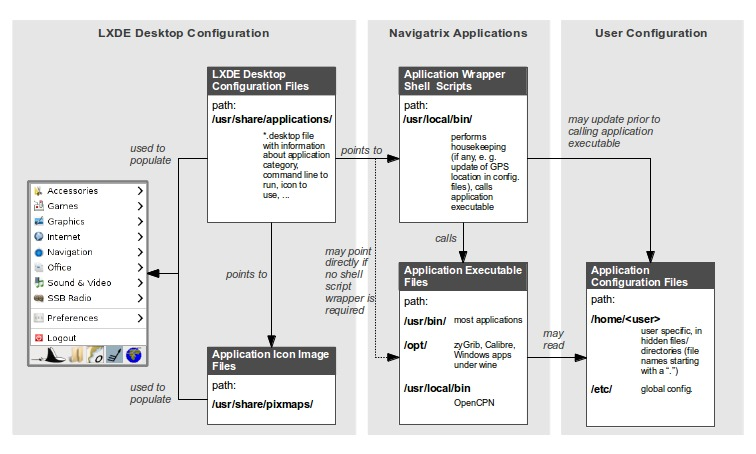
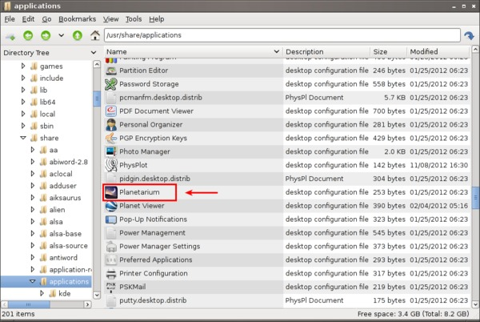

Configuring and Customizing Navigatrix
======================================

One of Navigatrix strength is that it just works out of the box, without
the need for constant updates and patches. However, you may want to
customize some of its features and/or to install additional software. To
do so, it helps to understand a little about how Navigatrix is set up
and where its various components can be found.

The LXDE Desktop
----------------

The core of Navigatrix is a Unix flavor called Linux and among the
available sub-flavors of Linux Navigatrix is based on Ubuntu. Naked Unix
interacts with the user through a command line interface (think “DOS
terminal window” in Windows) and Navigatrix runs what is called a
"desktop environment" on top of the command line interface to provide a
Windows-like user interface (tuned for simplicity, speed, and robustness
which makes it look a bit different). The desktop environment Navigatrix
uses is called the LXDE (for “Light X11 Desktop Environment”, X11 being
a “window standard” under unix) which is open source software designed
specifically to be very light-weight (i.e. being spartan in its use of
system resources). LXDE is started when you boot Navigatrix and it
provides the desktop interface, the panel at the bottom of the screen
with menu (the manta symbol - equivalent to the Windows "Start" menu"),
application launch bar, task bar (windows list), and a system tray. All
of these will all look familiar to Windows users. It relies on Openbox
(a subsidiary program) as a window manager which renders the windows and
menus that applications need for their user interfaces. In addition, it
uses PCManFM as a light-weight file manager with a similar look and feel
as the Windows file manager.

You can customize most elements of LXDE (e.g. appearance, what short-cut
icons to show in the application launch bar) by right-clicking on the
corresponding element and then choosing the relevant "Settings" item.
The resulting dialogues should be largely self-explanatory.

 |LXDE Panel Components|

Note that the application icons in the Application Launch Bar are
different from the Navigatrix-default because the screenshot was taken
with a customized version of Navigatrix.

The picture below shows an example of the overall Panel Preferences
dialogue (right click on any section of the panel and chose Panel
Settings).

 |Panel Preferences Dialogue|

To change the appearance and behavior of windows (colors, placement of
controls, border sizes, ...) you can use the Openbox configuration
manager which is available under the *Manta Menu -> Preferences ->
Configuration Manager*.

 |OpenBox Configuration Manager|

Other appearance settings (e.g. widget style, icon theme) can be
adjusted under *Manta Menu -> Preferences -> Appearance Settings*.

Running and Configuring Applications under LXDE
-----------------------------------------------

An important aspect of LXDE is how it provides access to the
applications that come with Navigatrix (or others which you may
install). The figure below shows an overview of how the different bits
and pieces interact in this context.

.. _confignx-figure-lxde-config-overview:

   LXDE Configuration Overview

Application Executable Files
~~~~~~~~~~~~~~~~~~~~~~~~~~~~

Applications under Navigatrix are executable files (think DOS/Windows
\*.exe) that reside in three different directories (see box “Application
Executable Files” in the figure above):

-  ``/usr/bin/`` hosts most of the applications that are accessible via the
   Manta Menu, plus many subsidiary and utility programs.

    |/usr/bin/ contents|

-  ``/opt/`` contains a few additional programs like the zyGrib GRIB viewer
   and the Calibre library manager. It also contains the virtual “C:
   drive” that is used by Wine, the Windows emulator that enables you to
   run Windows programs under Unix (see :ref:`confignx-installsw-windows`).

    |/opt/ contents|

-  ``usr/local/bin/`` contains the executable file for the OpenCPN
   chartplotter (admittedly a bit of an odd placement, because this
   directory is mainly used to store wrapper shell scripts; see below).

.. _confignx-app-wrapper-scripts:

Application Wrapper Shell Scripts
~~~~~~~~~~~~~~~~~~~~~~~~~~~~~~~~~

When you call many of these applications via the Manta Menu, Navigatrix does a
little additional housekeeping prior to actually launching the application
executable file. For example, Navigatrix may update the applications
configuration file with your latest GPS position (see :doc:`gps`). This
housekeeping is done by shell scripts (think Windows ``\*.BAT`` files) that
provide a “wrapper" around the actual application. These shell scripts are
stored under ``/usr/local/bin/`` (see box “Application Wrapper Shell Scripts”
in the :ref:`confignx-figure-lxde-config-overview` figure above).

To illustrate this, let’s look at the Planetarium application that can
be accessed via *Manta Menu -> Navigation -> Planetarium*.

 |Planetarium in Manta Menu|

The Planetarium application shows where stars and planets can be seen in
the sky from a chosen location and at a chosen time.  By default, the
time is the current system time in the current time zone (these can be
adjusted under *Manta Menu -> Preferences -> Time and Date*). The location
can be picked from a list of locations which the application reads from
a configuration file. The actual application executable is called
stellarium and resides under ``/usr/bin/``:

 |Stellarium executable in /usr/bin/|

However, when you click on Planetarium item in the Manta Menu, you
actually call a shell script called planetarium, that resides under
``/usr/local/bin/``:

 |Planetarium shell script in /usr/local/bin/|

The contents of this shell script is relatively simple (you can look at
it yourself by right-clicking on the planetarium file and choosing *Open
With... -> Text Editor*). There is no need to understand the details of the
script but it helps to illustrate the concept at a high level.

.. code-block:: bash
   :linenos:

   #!/bin/bash
   cfg=/home/$USER/.stellarium/data/user\_locations.txt
   echo >$cfg -e "Navigatrix GPS Location\\t\\tAutomatic\\t\\x00\\t147127\\t"$(cat /etc/nx.lat)"\\t"$(cat /etc/nx.lon)"\\t3\\t2\\t\\tEarth\\t"
   stellarium

Line 1 simple defines that this file is a shell script. Lines 2 and 3
then apply some clever manipulation to insert your most recent GPS
position in one of the configuration files that Stellarium reads when it
starts up. Line 4 finally launches the stellarium application executable
which will now read the updated configuration file and show you the sky
as it looks from your most recent GPS position. Navigatrix does this
kind of “position housekeeping” for quite a few applications - a very
handy feature on a computer that is used for navigation on a moving
vessel.

LXDE Desktop Configuration Files
~~~~~~~~~~~~~~~~~~~~~~~~~~~~~~~~

The link between the application wrapper shell script and the Manta Menu
(or between the application executable and the Manta Menu for
applications that don’t have wrappers) is established via so called
desktop configuration files with the extension .desktop. These reside
under ``/usr/share/applications/``. One such file exists per application
that is to be accessed via the Manta Menu or the LX Panel’s launch bar.
The figure below shows the ``/usr/share/applications/`` directory with
Stellarium’s desktop configuration file highlighted. Note that for these
files the file manager displays not the actual filename (which in this
case is stellarium.desktop) but the application title that is defined in
the file (which is “Planetarium”, see below).

 |planetarium.desktop file /usr/share/applications/|

If you open the file manager, go to ``/usr/share/applications/``,
right-click on “Planetarium”, and choose *Open With ... -> Notepad*, you
will see the filename stellarium.desktop displayed in the editor's title
bar:

 |planetarium.desktop in editor|

The first three lines look the same in all the desktop configuration
files in Navigatrix:

1. ``[Desktop Entry]`` at the top of the file indicates that this is a
   ``\*.desktop`` file.
2. The ``Type`` entry simply states that this configuration file points to
   an application.
3. ``Encoding`` defines that UTF-8 character encoding is used.

The next entries are specific to Planetarium / Stellarium:

4.  ``Name`` defines that this application will show up as “Planetarium" in
    the Manta Menu. This is also the name under which the file manager
    displays the desktop configuration file.
5.  ``GenericName`` provides a description for the menu entry.
6.  ``Exec`` points to the program that is to be launched for this
    application. In this case it is the planetarium shell script
    wrapper, which will update the position information as described
    above and then call the stelllarium application executable file.
    Note that there is path in front of “planetarium” because the
    directory ``/usr/local/bin/`` (as well as ``/usr/bin/``) is part of
    Navigatrix’ “search path”, i.e. the list of directories where it
    will look for executable programs if no path is provided.
7.  ``Icon`` points to an image file to be used as the application’s icon in
    the Manta Menu and the Launch Bar. Navigatrix stores these icon
    image files under ``/usr/share/pixmaps`` (you can find the file
    stellarium.xpm there). No path and no file extension is required if
    the icon can be found in this directory.
8.  ``StartupNotify=false`` defines that startup notification is turned off.
9.  ``Terminal=false`` states that the program will not run in a terminal
    (This is the setting for all applications that provide their own
    GUI).
10. ``Categories`` defines the category under which the application will be
    displayed in the Manta Menu (“Navigation”) in this case. Multiple
    categories can be specified for one application, with individual
    entries separated by a semicolon (e.g.
     ``Categories=Navigation;Education``).
11. ``Comment`` defines a descriptive text that is displayed as a “tool tip"
    when the mouse pointer hovers of the corresponding entry in the
    Manta Menu.
12. ``Comment [fr]`` defines the descriptive text when Navigatrix is run in
    French.

Once you have created a desktop configuration file for an application under
``/usr/share/applications/`` (or ``usr/local/share/applications/`` which is a
good place to put desktop configuration files you may create yourself in order
to keep them apart from the ones that come with Navigatrix), the application
will show up in the Manta Menu and also be available in the configuration
dialogues for the Panel’s Launch Bar. Note that the list of applications on
the left is different from the Navigatrix-default because the screenshot was
taken with a customized version of Navigatrix:

 |Planetarium entry in Application Launcher|

.. _install-add-sw:

Installing Additional Software
------------------------------

For the sake of this Short Introduction we can distinguish three
principal ways to install additional applications under a Linux-based
system like Navigatrix:

#. Compiling the application from source code: Though it is by no means
   "magic", this is beyond the scope of this Short Introduction. In fact, if
   you’re thinking about compiling from source, you probably won’t be reading
   this anyway...
#. Installing binaries from a Linux repository: This installs an already
   compiled (= binary) version of an application, similar to the way you
   would install software under MS Windows. However, these application
   binaries are maintained in and available from software repository
   servers. The concept of software repositories and how to access these
   is explained below.
#. Installing MS Windows applications under “Wine”, a compatibility
   layer for running Windows applications on Linux. This will also be
   covered :ref:`below <confignx-installsw-windows>`.

.. _installsw-from-linux-repo:

Installing Applications From a Linux Repository
~~~~~~~~~~~~~~~~~~~~~~~~~~~~~~~~~~~~~~~~~~~~~~~

Under Linux, software is organized in “packages” which are maintained in
repositories on central serves. Linux systems (such as Navigatrix) come
with a Package Manager that allows you to interface with these
repository servers and to manage adding and removing software to and
from your system in an “orderly fashion.”

This is a bit different from what you may be used from a MS Windows
environment. There, a software application is typically distributed by a
commercial vendor as a self-contained collection of files which are
shipped on a CD/DVD together with some executable installer program that
can be run to install the files in that collection
as a new application. You basically trust the vendor that
installing its application in this manner will not negatively impact any
existing functionality on your system and not be at logger heads with
other applications you have installed.

Linux takes a slightly different approach to software installation.
Applications (which have typically been developed as open source
projects) will be added to a central software repository by “the
community” or commercial distributors and are available for download and
installation from designated repository servers. These repositories also
maintain all the dependencies between different packages. When you
request an application from a repository, the process (which is explained
further below) will automatically check if there are any subsidiary
packages that the requested application relies on and which have not
been installed on your system yet. It will then include these subsidiary
packages into the download and the installation. This more centralized
approach to software distribution somewhat reduces the risk of different
applications causing each other trouble. If there is a chance for
conflict (for example, because two applications require different
versions of the same subsidiary package) you will be notified of the
issue prior to the installation and can at least make an informed
choice.

This may all sound complicated but is actually quite straight forward
once we look at the tools involved and an example further below.

The tool used to connect to software repositories and to download and
install software packages is the “Synaptic Package Manager” which is
accessible from the Manta Menu under *Preferences->Package Manager*

 |Synaptic in Manta Menu|

To run the Package Manager you will need administrative (“root”) privileges.
When you launch the application you will therefore be prompted for the
password that you defined when :ref:`installing
Navigatrix <install-password>` (provided you
haven’t changed it since then).

 |Password entry|

A word of caution here: With great power comes great responsibility. The
Package Manager allows you to perform changes to the core of your
system. You can render your system unusable by using the Package Manager
carelessly. This should not be an issue as long as we’re simply talking
about adding, updating or removing applications and are not messing with
the system core. Just make sure you understand what you are doing in
each step when working with the Package Manager.

There is detailed documentation for the Package Manager that comes with your
Navigatrix installation. We will therefore only illustrate its use by walking
through a simple installation example which should be sufficient to get you
started. For more detailed information you can access the `offline manual
<file:///usr/share/synaptic/html/index.html>`__ at
``/usr/share/synaptic/html/index.html`` (type ``file:///usr/share/synaptic/html/index.html`` into your browser's address bar).

 |Synaptic manual|

But now back to the Package Manager's main window which will open up
after entering your password:

 |Synaptic main window|

The Package List on the top right shows the software packages which are
available from the repositories that are configured in the Package
Manager (see the
`manual <file:///usr/share/synaptic/html/ar01s04.html>`__ for details on
how to configure additional repositories should you ever need to do so [#fn-synaptic-repos]_).
You can narrow this list down by using the Category Selector on the left
of the main window. Alternatively, you can search for packages by either
entering a search term in the “Quick search” box on the toolbar or by
clicking the “Search” icon to the right of the Quick search box:

 |Synaptic search|

For our example, let’s assume we want to install Lingot, a handy little
musical instrument tuner that picks up a tone via your computer’s
built-in microphone and shows you whether you’re on or off tune. Its
interface looks like a guitar tuner but it can be used for any
instrument - including the on-board piano. You will need an Internet
connection to try this. The application is very small (download size <
100 kB) so even a marginal connection should do (if you have one of
those you may wish to skip the refresh of the Package List in the next
step).

Before we go and look for Lingot in the Package List it is advisable to
reload the list of available packages from the repository servers.
Otherwise what you see in the Package Manager’s Package List may be out
of date and not accurately reflect what's on the server. To update the
list of available packages simply press the “Relaod” button on the
toolbar:

 |Synaptic reload|

This will take a moment and show you a progress window while it is
downloading the latest package information.

Once it is done type “lingot” (without the quotes, capitalization
doesn't matter) in the Package Manager’s “Quick search” bar. Make sure
that you have selected “All” in the Category Selector on the left in
order not to filter out Lingot from the search results. The Package list
will now only show you the one matching entry for Lingot:

 |Lingot search result|

The left-most column you see in the Package list window (the one
labeled “S” - assuming you haven’t changed this yet under
*Settings->Preferences->Columns and Fonts*) shows the package’s status.
The empty little box you see in the example indicates that this package
has not been installed on your computer yet. (For a list of the possible
stati and their corresponding icons you can look under *Help->Icon
Legend*.)

The empty column between the status indicator and the package name
indicates the level of support provided for this package. If it’s empty
it means that you cannot rely on this package being maintained in the
repository in the future but this doesn’t bother us in this example.

The next columns simply list the package name, the installed version (in
case the package displayed is already installed on your machine), the
latest available version in the repository, and a short description.

To see more information about a package, simply select it in the package
list and click on the Properties button in the toolbar:

 |Lingot properties|

The tabs in the properties window should be self-explanatory. It’s worth
looking at the “Dependencies” tab which lists all the other packages
that Lingot will require to run. These are typically software libraries
that provide basic functionality shared by many applications. Most of
these will likely already be installed on your system. If not, the
Package Manager will automatically include them in the download and
install them together with Lingot.

Now let’s close the properties window and proceed with the actual
installation. This is a two-step process:

1. Mark the package for installation. To do so, right click on the
   package in the Package List and select “Mark for installation”.

    |Marking Lingot for installation|

   This will change the icon in the “Status” column which will now
   display the “Marked for installation” symbol:

    |Marked for installation icon|

2. To actually start the download and installation of Lingot now click
   on the “Apply” button in the toolbar:

    |Applying marked changes|

   This will bring up a window summarizing the changes that will be made
   to your system if your proceed with the installation:

    |Summary of changes before installation|

   In this case we’re being informed that the package cannot be
   authenticated (which - for all we know - is OK in this case), that
   one package is to be installed (lingot), and that a whole load of
   subsidiary package will remain unchanged because they’re already
   installed. Depending on what’s already installed on your system this
   listing may look slightly different if you try this on your computer.

   Clicking on “Apply” will start the download and installation during
   which the progress window below will be displayed:

    |Installation progress|

   Once it’s done it will display a confirmation that all changes have
   been applied:

    |Installation complete|

   Notice that the Lingot entry in the Package List now shows the icon
   for “Installed” in the status column and that it now lists an
   installed version:

    |Package list after installation|

That’s it. You should now see Lingot as an entry in the Manta Menu under
Sound & Video:

 |Lingot inn the Manta Menu|

A few comments before you get out the guitar / ukulele or whatever you
use on board for musical entertainment:

-  Software Repositories may also reside on CDs/DVDs or in a directory
   within the file system on your computer. These can be configured in
   the Package Manager in the same way as the pre-configured repository
   servers used in the example above. Check the  `Package Manager's offline
   manual <file:///usr/share/synaptic/html/ar01s04.html>`__ for details.

-  The Synaptic Package Manager is in essence simply a graphical user
   interface to a command line tool called “apt-get”. In many places in
   the Navigatrix Support discussion database you will find instructions
   stating something like “... at the terminal prompt type ``sudo apt-get
   install ...``  followed by the name of some software package. This
   triggers the same download and installation process as in the example
   above but is a bit quicker if you know the name of the package you
   need to install and you don’t mind working in a terminal window
   (after all - “In the beginning was the command line”...).

-  Downloaded packages are kept in a local archive on your computer in
   ``/var/cache/apt/archives/``:

    |APT archive in File Manager|

-  Note that these are not the actual application executable files but
   the downloaded packages from which the actual application files were
   extracted.

-  If you need to re-install something while being at anchor, in a
   location without Internet access, you can fall back on this archive.
   Let’s say you have removed Lingot after going through the example
   above (via the Package Manager - simply right-click on an installed
   package and select ``Mark for Removal`` rather than ``Mark for
   Installation``). But now you have picked up a ukulele on some remote
   Polynesian island (no Internet) and need the tuner again. Press
   ``[ctrl]+[alt]+[T]`` to open a terminal window and at the prompt type ::
   
    sudo apt-get -m --no-download install lingot

-  This will re-install the software from the local archive in
   ``/var/cache/apt/archives/``. The ``sudo`` is required to run the apt-get
   with administrator (“root”) privileges (and will therefore prompt you
   for your password). The ``-m`` option tells The apt-get to ignore any
   missing subsidiary packages (which you may not have in your local
   archive) and to hope for the best. Make sure you type one minus sign
   in front of the “m” and two minus signs in front of the “no-download”
   option with no paces between the minus signs and the following
   option.

-  In a pinch you can also use these downloaded packages to share an
   application with another disconnected boat at anchor (however,
   missing subsidiary packages on which the application depends may
   cause an issue in this case). You can give your neighbour a USB stick
   with the relevant package file (ending in ``.deb``). The neighbour -
   also running Navigatrix or another Linux flavour - can copy this file
   to his or her hard disk, open a terminal window, and type::

    sudo dpkg -i /[complete path to the package file]/[complete name of the package file]

-  ``dpkg`` is another command line tool used to install Debian packages
   (the ones that end in ``.deb``). In the example above we could have
   also re-installed Lingot by typing ::

    sudo dpkg -i /var/cache/apt/archives/lingot\_0.7.4-2\_i386.deb

   at the terminal window’s command prompt. Note that the latter
   approach via dpkg requires the full path and filename whereas apt-get
   only uses the package name (“lingot” rather than the file name
   ``lingot\_0.7.4-2\_i386.deb``). Also note that the Synaptic Package
   Manager application must be closed when running dpkg. Otherwise dpkg
   cannot access the status database that keeps track of the various
   packages’ status on your computer (not-installed, installed, ...).

-  Finally, a word about upgrades. The Package Manager also provides an
   option to mark all possible upgrades for installation. This will
   check for all your installed packages if a newer version is available
   from a repository and, if so, mark this newer version for
   installation (you can also do this for individual packages). Use this
   option only with extreme care and only if you have a good reason to
   replace an existing package by a newer version. The software industry
   has been very good at conditioning us to believe that “upgrade =
   newer = better” - which in many cases is simply not true and/or
   heavily depends on what you intend to do with an application. If an
   application is stable and does what you need it to do, replacing it
   by a newer version will - in many cases - not gain you anything but
   introduce a less mature and less stable product. The applications
   that ship with Navigatrix have been carefully put together to do what
   they need to do without getting in each others’ way. Hence Navigatrix
   may not include the latest available version of an application but
   one that is robust and works with all the other stuff in Navigatrix.
   Keep this in mind before upgrading to newer versions of packages (for
   which there may be good reasons in specific cases).

.. _confignx-installsw-windows:

Installing Windows Applications
~~~~~~~~~~~~~~~~~~~~~~~~~~~~~~~

Coming soon, currently under construction ...

.. rubric:: Footnotes

.. [#fn-synaptic-repos] Depending on your location you may want to change the
                        default repository in Synaptic in order to connect to
                        a server that's not halfway around the world. In the
                        Package Manager, under *Settings->Repositories*, you
                        can pick a repository server that is closer to your
                        location by clicking on the ``Download from:``
                        drop-down box. This will also provide you with an
                        option to have the application automatically pick an
                        optimal server fro your location.

.. |OpenBox Configuration Manager| image:: images/openbox_config_mgr.jpg

.. |Package list after installation| image:: images/synaptic_lingot_packlistafterinstall.jpg

