Installing Navigatrix
=====================

This section explains how to install Navigatrix from a bootable USB
stick, SD card or DVD as well as configuring Navigatrix for different
languages.

*NOTE: the instructions and screenshots below refer to Navigatrix
version 0.5 (ISO downloaded in or after July 2013). For instructions on
how to install the earlier 0.4 version of Navigatrix please see*
:doc:`install_nx04`.

Installing Navigatrix onto the Hard Disk
----------------------------------------

Once you have a bootable USB stick/SD card or DVD with Navigatrix (see
:doc:`getnx`), installing it to your harddisk is straight forward. You can
install Navigatrix alongside your current operating system, choosing between
Navigatrix and your current system when you boot your computer.

First, boot Navigatrix from your USB stick/SD card. You may have to
press some function key while the computer starts up in order to tell it
to boot from a USB device rather than the hard disk. Most computers will
display something like ``Press <F2> to enter setup`` for a few seconds on
the bottom of the screen before the operating system starts booting.
Once Navigatrix is up and running you will a screen that looks like
this:

   |Navigatrix Desktop|

You can use the system as is, running from the USB device. The interface
logic is similar to Windows XP or later: You launch applications by
clicking on the little Manta symbol in the bottom-left of the screen
(see :doc:`nxapps` for details on what you will find under the Manta Menu).

Once you decide to install Navigatrix to your harddisk (it will run and
boot much faster compared to the USB stick), double-click on the
“Harddisk install option” in the top-left of the desktop:

   |Harddisk install option on desktop|

This will launch a set-up program that will take you through the
installation process.

1. The first screen will ask you about the language in which you want to
   run the installation. Note: this is not the language that Navigatrix
   will run in once it is installed but simply the langauge for the
   installation dialogue.

    |Language for installation procedure|

2. Next comes a check whether the pre-requisites for an installation are
   met on your system.

    |Installation prerequisites|

   Do *not* select the options Download updates while installing and
   Install this third-party software on this form. These updates are not
   required for running Navigatrix and they are likely to do more harm
   than good if selected. In addition to using up potentially scarce
   network bandwith for the download, an uncontrolled blanket update may
   lead to individual components of Navigatrix no longer working
   smoothly together. The versions of the various pieces of software
   that together make up Navigatrix have been carefully chosen to make
   these pieces work together and interface with external devices such
   as GPS, Pactor, and AIS. For software “newer” often does not mean
   “better” when it comes to reliability. If required you can update
   individual components of the system after the installation has
   completed.

   If you are in range of a wireless network you will next be asked
   whether you want to connect to that network during the installation.
   For the reason stated above, do *not* connect to this network during
   installation (in fact if you have a wired network connection you may
   want to disconnect it during the installation - just to be on the
   safe side...).

    |Wirless connection for installation|

.. _install-instalation-type:

3. Now we get into the thick of things, defining how and where Navigatrix is to
   be installed.

    |Installation type|

   The easiest case is to have the set-up program wipe your hard drive and
   install Navigatrix as the only operating system on your computer (option
   2 in the image above). However, in most cases you will want to install
   Navigatrix *alongside* an existing operating system (e.g. Windows or
   another Linux distribution) and to choose at each boot which operating
   system you want to run. This can be done with options 1 and 3 in the
   image above. Option 1 will automatically create a new partition on your
   hard drive into which Navigatrix will be installed. Under option 3 you
   can choose into which existing partition(s) Navigatrix is to be
   installed. In this case you can also place different branches of the
   file system into different partitions. For example, you can put the
   directory tree under /home into a seperate disk partition which makes
   updating to a new version of Navigatrix in the future easier (you will
   only have to replace the system files with the new version but keep all
   your data and configuration files under /home).

   *Note: If option 1, “Install Navigatrix alongside them” appears greyed out
   (inactive) please see* :ref:`install-special-cases` *at the end of this
   page.*

   Following we will first describe the installation with the simpler
   option 1 above. This is sufficient for computers with only one existing
   operating system. If you already have more than one operating system on
   your computer and/or you are familiar with setting up and managing
   partitions on your hard drive you should choose option 3 which will be
   described further down.

   Let's start with option 1, *Install Navigatrix alongside them*. With
   this option the only thing you will have to do is to specifiy how much
   hard disk space you want to dedicate to Navigatrix:

    |Adjusting partition size|

   As shown in the image above, you can drag the bar that separates the
   exisiting hard disk partition from the one to be created for Navigatrix.
   Moving this bar will adjust the size ratio between the two partitions.
   If you plan to leave your music, image, and video files on your existing
   partition, 40-50GB should be a generous allowance for Navigatrix to
   accommodate charts, email, a digital library, a compressed off-line
   version of wikipedia, and other application data. If in doubt do a quick
   sanity check based on your expected requirements. The Navigatrix
   operating system (including pre-installed applications) will occupy
   about 6GB, leaving the remainder of the partition for user data (incl.
   charts, email, etc.) and additional applications you may want to
   install. You will be able to access files in an exsiting Windows
   partition from Navigatrix but not the other way around - you won't be
   able to access files stored in the new Navigatrix partition from
   Windows.

   Under option 1, *Install Navigatrix alongside them*, this all you will have
   to do here and you can continue with :ref:`step 4 <install-keyboard-layout>`
   below. If you chose option 3, *Something else* above there are a few more
   things to do.

    |Installing as something else|

   If you want to go down this road it is best to set up the required
   partitions *before* you start the installation procedure. You can use
   GParted which comes with Navigatrix (available under *Manta menu ->
   Preferences -> Partition Editor*). We assume that someone choosing option
   3 will be familiar with these tools. Alternatively, you can refer to
   GParted's comprehensive “Help” documentation and `this
   post <http://navigatrix.net/viewtopic.php?p=1458#p1458>`__ on the
   Navigatrix Support Discussion Board provides some good pointers as well.

   A typical Navigatrix installation under option 3 may use three
   partitions:

   a. One partition of about 10GB to accommodate the operating system and
      pre-installed applications. This includes some reserve in case you
      later choose to install additional applications. Choose “ext4” as the
      file system for this partition.
   b. A swap partition to which memory operations can be off-shored if your
      computer runs out of RAM. Setting up this partition is only required
      if you don't already have an existing linux-swap partition on your
      har disk (will be visible as such in GParted). 4GB for this
      swap-partition should be a generous allowance.
   c. The remaining available hard disk capacity can be used for a
      partition for the home directory in which user files and user
      specific configuration data will be stored. This partition should
      also be set up as an “ext4” file system.

   Note: Most PC-type computers will only allow a maximum of four *primary*
   partitions on a hard drive. You can get around this limitation by
   setting the fourth partition up as an *extended* partition which can
   then house many more logical partitions. See `this
   post <http://navigatrix.net/viewtopic.php?p=1458#p1458>`__ on the
   Navigatrix Support Discussion Board for some practical pointers.

   Separating the home directory from the rest of the system as described
   above will come in handy if you ever want to upgrade to a new version of
   Navigatrix in the future. You will then only have to drop the new system
   into the first of the three partitions listed above while retaining all
   your user and configuration files under home in a separate partition.

   Once you have set up the required partitions and selected Something else
   in the form above, you will see the following dialogue:

    |Installation type details 1/3|

   Here you define into which partition(s) the various pieces of the system
   should be installed. Pick the relevant partition under “Device” and
   click on the Change... button below the device listing. This will open
   another dialogue window in which you can define the settings for each
   partition:

    |Installation type details 2/3|

   If the partitions were already set up and sized correctly, you can leave
   the size unchanged. Just click on the Use as drop-down arrow and select
   Ext4 journaling file system. Selecting the file system type will open
   another field labeled “Mount point”.

    |Installation type details 3/3|

   Click on the drop-down arrow next to the Mount point field and select
   which branch of the file system should be installed into this partition.
   Select the root directory (“/”) for the operating system including
   pre-installed applications. For your home directory select “/home”. If
   required you can also choose to format these partitions. Don't format a
   home partition that has data you wish to retain!

   Once you made your selections you will see a warning that these changes
   will have to be written to disk before proceeding. Click on Continue.
   Once you're done with specifying your desired set-up click on Install
   now.

.. _install-keyboard-layout:

4. Next, you will be asked about your keyboard layout. Test that your
   choice works correctly by typing a few special characters in the box
   at the bottom of the screen. This is important as you will later be
   asked to choose a password. If you enter your choice of password with
   the installer assuming a different keyboard layout, you may not be
   able re-create the password later.

    |Selecting a keyboard layout|

5. A question about your location is next in order to set time zone and
   number/date formats correctly (you can change these later under Manta
   -> Preferences -> Time and Date and Manta -> Preferences -> Language
   Support).

    |Picking your location|

.. _install-password:
 
6. Next, you will be asked to choose a user name and password.

    |Picking user name and password|

   It is important to remember the password that you enter in this step
   (even if you choose “Log in automatically”). There are some
   operations on a Unix/Linux system that will require you to
   authenticate yourself as “root” user (think “administrator” in
   Windows Vista and later versions) and will ask for this password (for
   example, when you want to install additional software).

7. That's all. Once you clicked “Continue” on the previous form the
   installer will do it's magic - which may take a moment or two. Once
   it's done you'll see a confirmation message.

    |Installation complete|

   Note: If you want to start Navigatrix from your hard disk right away,
   first shutdown with your USB stick/SD card still plugged in. Unplug
   the device once the computer has shutdown, and then restart it from
   the harddsik. If you click “Restart” in the previous dialogue you may
   mess up the file system on your USB stick/SD card if you unplug it
   while your computer is still running Navigatrix off it.

The next time you boot from your harddisk you should see the boot loader
displaying a selection menu that allows you to choose which operating
system you want to boot (Navigatrix or whatever you were running up to
now). See :ref:`here <install-grub-trouble>` if the boot
loader fails to display your old operating system as a choice.

Enjoy!

Changing the Default Language for Navigatrix
~~~~~~~~~~~~~~~~~~~~~~~~~~~~~~~~~~~~~~~~~~~~

After you have installed Navigatrix on your hard disk you can change the
default language for the user interface by following the instructions in
`this post <http://navigatrix.net/viewtopic.php?p=1835#p1835>`__ on the
Navigatrix Support Discussion Board. Version 0.5 of Navigatrix already
comes complete with English, Spanish, French and -as of September 2013-
German language packs. For these languages you won't have to download
any additional packages and can simply re-arrange the preference order
for the languages as described in the Discussion Board post. For other
languages you will have to download the relevant langauge packages
(dictionaries, thesaurus, ...) first (also decribed in the Discussion
Board post).

.. _install-special-cases:

Notes on Special Cases
----------------------

Installer does not offer "side by side" installation of Navigatrix alongside an existing operating system
~~~~~~~~~~~~~~~~~~~~~~~~~~~~~~~~~~~~~~~~~~~~~~~~~~~~~~~~~~~~~~~~~~~~~~~~~~~~~~~~~~~~~~~~~~~~~~~~~~~~~~~~~

Depending on how your harddisk has been partitioned prior to isntalling
Navigatrix you may not see the "Install them side by side" option in
step 4 above. On "traditional" harddisks used for Windows-equipped
computers, the partition scheme only allows a maximum of four so called
“primary partitions”. If your harddisk already has four partitions then
the Navigatrix installer will be unable to create another partition for
Navigatrix. In this case the dialogue above would look like this (note
that the screenshot below is still from the 0.4 version of Navigatrix
but the essence hasn't changed with version 0.5):

 |Step 4/7 with four existing primary partitions|

If you select “Specify partitions manually (advanced)” in the window
above you can actually see the four partitions listed as in the example
below:

 |Step 5/8 with four existing primary partitions|

In this case quit the installation process. You will have to re-shuffle
your partitions prior to installing Navigatrix in order to get around
the four partition limitation. The way to do this is to first delete the
last of the existing primary partitions (after backing up all the data
from that partition to restore it later). In its place you then create
what is called an "extended partition". This extended partition is
simply a container in which you can fit additional partitions as needed.
From "the outside" it still looks like four partitions - in line with
the maximum - but with one of them (the "extended" one) being able to
house additional partitions, you can in effect get around the
four-partition limit.

This may sound complicated but is in fact pretty straight forward if you
work carefully and make sure you have backed up the data from any
partitions you change during this process. Navigatrix comes with a tool
that allows you to delete, resize, move and create partitions on you
harddisk. You can find it in the Manta Menu under Preferences->Partition
Editor:

 |GParted in Manta Menu|

Also check out `this
post <http://navigatrix.net/viewtopic.php?p=1458#p1458>`__ on the
Navigatrix Support Discussion Board for more info and some practical
pointers.

Running Navigatrix on newer hardware (2011+)
~~~~~~~~~~~~~~~~~~~~~~~~~~~~~~~~~~~~~~~~~~~~

Starting in 2011, an increasing portion of new computers are shipped
with a “next generation BIOS” called “UEFI”, the Unified Extensible
Firmware Interface. Originally introduced by Intel as EFI, UEFI is
simply a newer version of EFI and you see the two abbreviations used
interchangeably. Among other things, the boot process under EFI is
different from traditional BIOS booting. While Navigatrix version 0.5
will run on (U)EFI machines, you may have trouble installing it in "Dual
Boot" mode alongside another operating system. See `this
post <http://navigatrix.net/viewtopic.php?p=2777#p2777>`__ on the
Navigatrix discussion board for further details.

.. _install-grub-trouble:

GRUB Boot Manager does not show Windows option in boot selection menu
~~~~~~~~~~~~~~~~~~~~~~~~~~~~~~~~~~~~~~~~~~~~~~~~~~~~~~~~~~~~~~~~~~~~~

When you install Navigatrix alongside Windows (choosing option 1, “Install
Navigatrix alongside” in `step 3 <install-instalation-type>` above) it will
also install “GRUB” the “Grand Unified Boot Loader/Manager”. GRUB installs
itself into your systems “Master Boot Record” (or it's UEFI/GPT equivalent if
you have a new computer that shipped with Windows 8). When your computer now
boots it launches GRUB rather than an operating system. GRUB then asks you
which operating system you actually want to boot (Windows or Navigatrix) and
launches the operating system of your choice.

There have been cases where - once you reboot your computer after installing
Navigatrix - GRUB only shows a single entry for Navigatrix as a boot option and
entry for Windows. Should you encounter this issue it can easily be fixed via
the GRUB Customizer which is available (with installation instructions) `here:
<http://navigatrix.net/viewtopic.php?p=1200#p1200>`__.  Download the package,
install it under Navigatrix on your harddrive, and then launch it from the
Manta Menu under Preferences->Grub Customizer.

 |GRUB Customizer in Manta Menu|

To launch the GRUB Customizer you will have to enter the password which you
:ref:`set up during the installation <install-password>`. Once the GRUB
Customizer is up, it will automatically scan your harddisk for bootable
operating systems. When that is completed it should show entries for Navigatrix
and Windows (plus some other stuff like “memtest” which you can ignore at this
point). Simply press “Save” and exit the GRUB Customizer. The next time you
boot, the GRUB selection menu should give you a choice between Navigatrix and
Windows.

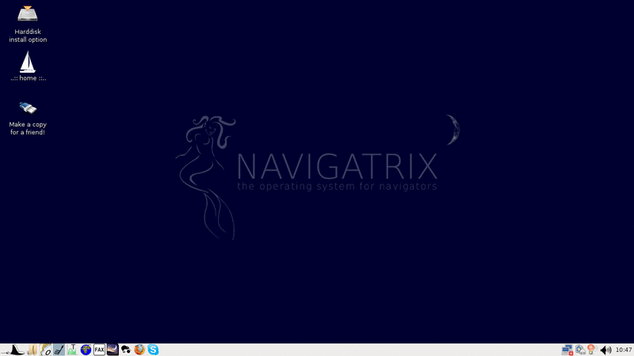
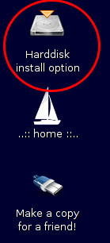
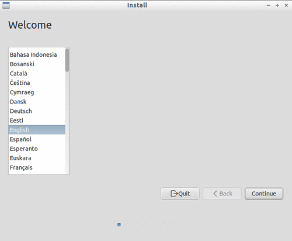
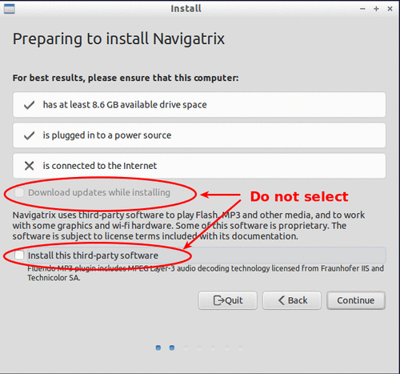
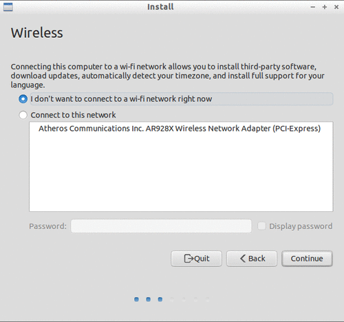
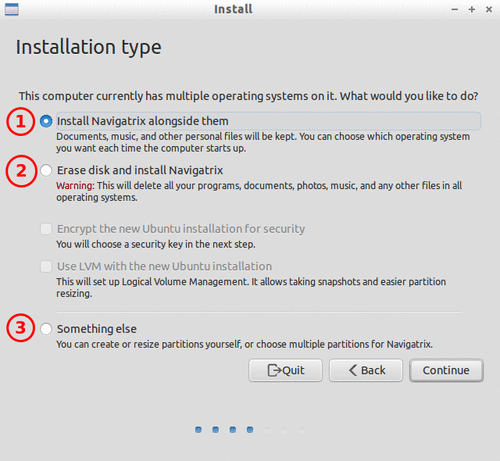
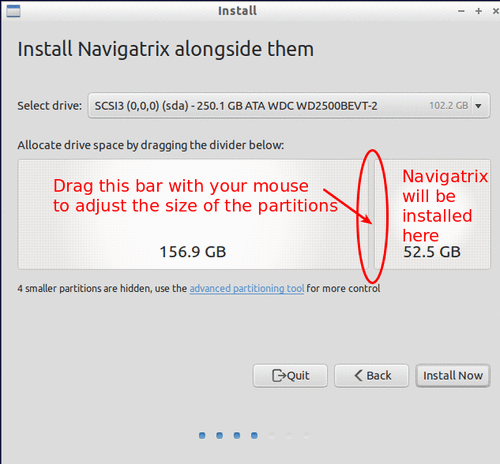
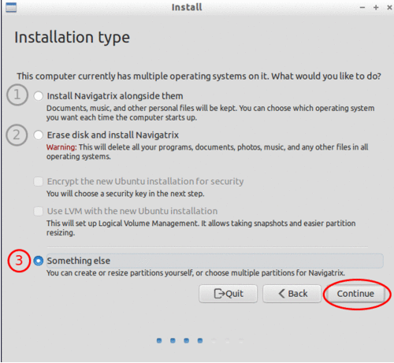
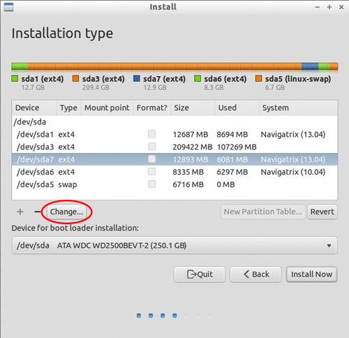
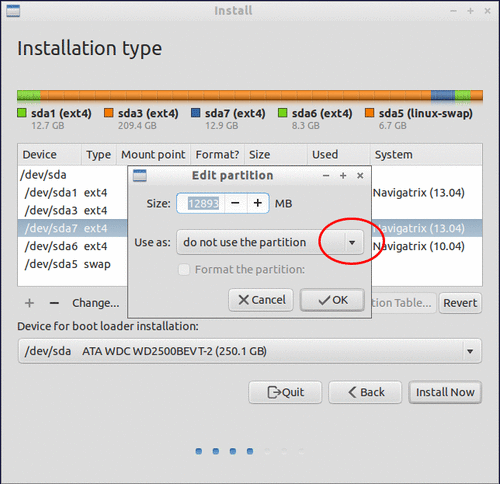
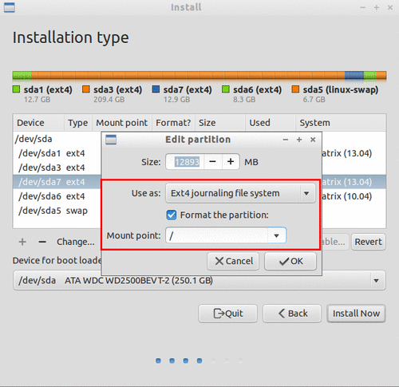
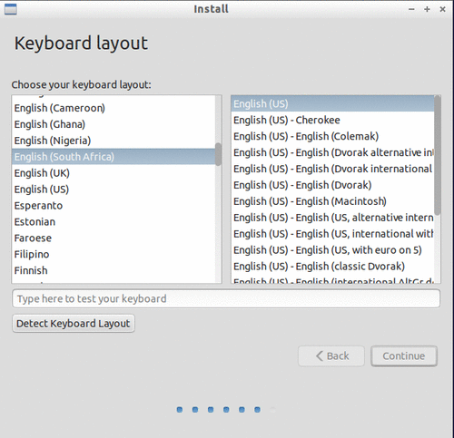
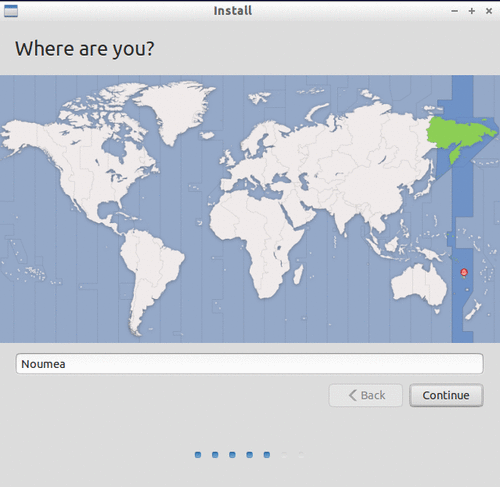
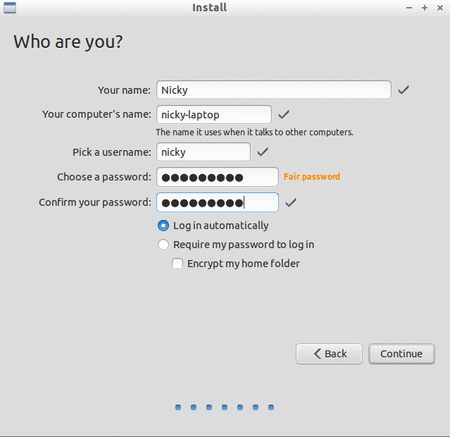
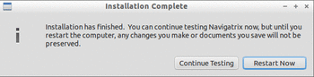
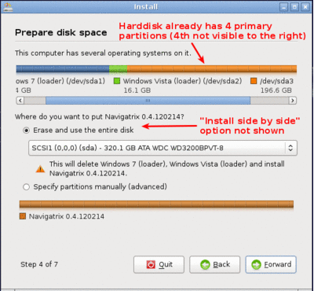
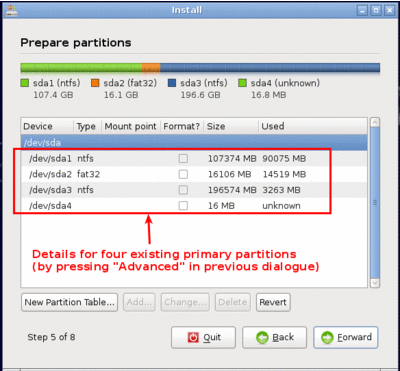
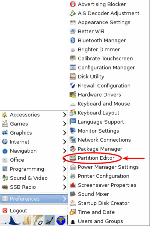
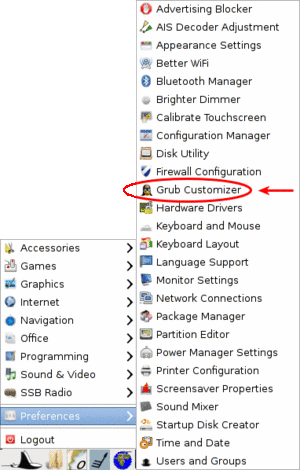
