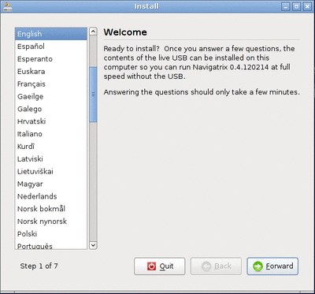
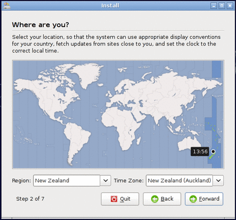
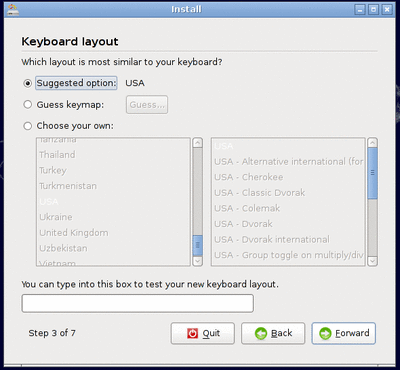
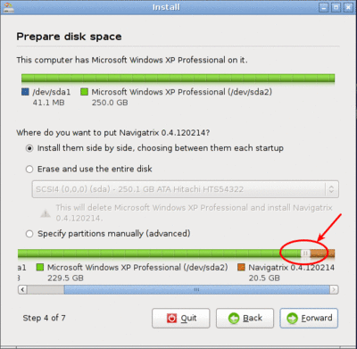
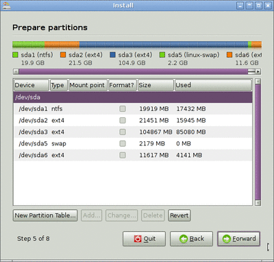
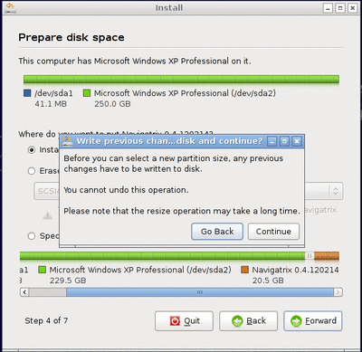
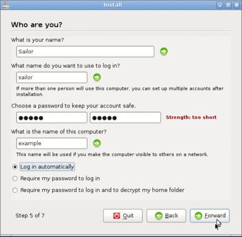
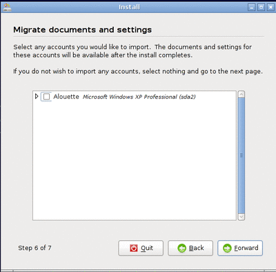
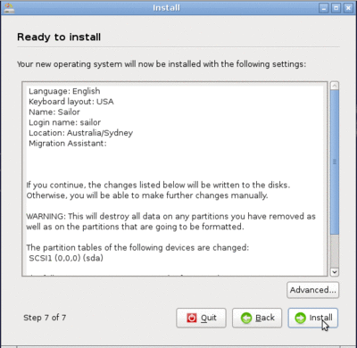

`Table of Contents <index.html#toc>`__

`Navigatrix home <http://navigatrix.net>`__

Installing Navigatrix Version 0.4
=================================

*NOTE: the instructions and screenshots below refer to Navigatrix
version 0.4 (ISO downloaded before July 2013). For instructions on how
to install the current Navigatrix version 0.5 please see
`here <03_installing_nx.html>`__.*

Once you have a bootable USB stick/SD card or DVD with Navigatrix (see
“\ `Getting Navigatrix <02_getting_nx.html>`__\ ”), installing it to
your harddisk is straight forward. You can install Navigatrix alongside
your current operating system, choosing between Navigatrix and your
current system when you boot your computer.

First, boot Navigatrix from your USB stick/SD card. You may have to
press some function key while the computer starts up in order to tell it
to boot from a USB device rather than the hard disk. Most computers will
display something like “Press <F2> to enter setup” for a few seconds on
the bottom of the screen before the operating system starts booting.
Once Navigatrix is up and running you will a screen that looks like
this:

|Navigatrix Desktop|

You can use the system as is, running from the USB device. The interface
logic is similar to Windows XP or later: You launch applications by
clicking on the little Manta symbol in the bottom-left of the screen
(see “\ `The Applications <04_applications.html>`__\ ” for details on
what you will find under the Manta Menu).

Once you decide to install Navigatrix to your harddisk (it will run and
boot much faster compared to the USB stick), double-click on the
“Harddisk install option” in the top-left of the desktop:

|Harddisk install option on desktop|

This will launch an installation program that will take you through
seven steps and ask a few questions along the way.

#. The first screen will ask you about the language in which you want to
   run the installation. Note: this is not the language that Navigatrix
   will run in once it is installed but simply the langauge for the
   installation dialogue.

-  |Installation step 1/7|

2. Next, you will be asked about your location in order to set time zone
   and number/date formats correctly (you can change these later under
   Manta -> Preferences -> Time and Date and Manta -> Preferences ->
   Language Support).

-  |Installation step 2/7|

3. Your keyboard layout is next. Test that your choice works correctly
   by typing a few special characters in the box at the bottom of the
   screen. This is important as you will later be asked to choose a
   password. If you enter your choice of password with the installer
   assuming a different keyboard layout, you may not be able re-create
   the password later.

-  |Installation step 3/7|

4. Now you are ready to define how you want to install Navigatrix.
   Assuming that you want to run it alongside your current operating
   system (which in the screenshot below was Windows XP), choose
   “Install them side by side, choosing between each at startup”. This
   will leave your existing system and files untouched, and install
   Navigatrix as an additional operating system on a free portion of
   your harddisk. In addition to installing Navigatrix, it will also put
   a “boot loader” on your harddisk which will allow you to choose which
   operating system you want to use each time you boot up your computer.
   At the bottom of the window you can define how much disk space you
   want to allocate to Navigatrix by dragging the little slider
   highlighted by the red circle below.

-  |Installation step 4/7|
-  By default the installer will split space between your old operating
   system and Navigatrix roughly 50:50 (depending on available free disk
   space). In the screenshot above that split was adjusted to give
   Navigatrix 20GB and leaving Windows with about 230GB. If you plan to
   use Navigatrix primarily for navigation (including storage of your
   charts), email (Airmail plus some shorebased account), weather data,
   and documents, but leave photos, videos and music files on your
   existing (Windows) partition, 20-30GB should give you plenty of
   space. You can also access your Windows files from Navigatrix in case
   it ends up being your “primary system” (as often seems to be the
   case...).
-  If you are in the mood for a bit of an adventure you can go for the
   “Specify partitions manually (advanced)” option in this step. This
   would allow you, for example, to put your “home” directory (think
   Windows “Documents and Settings”) on a separate partition which would
   later allow you to change to a new version of Navigatrix without the
   files in your“home” directory being affected (see
   `http://navigatrix.net/viewtopic.php?f=4&t=261 <http://navigatrix.net/viewtopic.php?f=4&t=261>`__
   in the Navigatrix Support Discussion database). However you should
   only go down this road if you are comfortable with manually defining
   partitions and mount points. The screen you would get if you chose
   that option would look like this:
-  |Installation step 5/7 - advanced partitioning|
-  For the sake of this “Short Introduction” we assume that you stick
   with the “Install them side by side” option. You can always back up
   the files in your “home” directory in case you change to a newer
   version of Navigatrix at some point in the future (and: one of the
   nice things about Navigatrix is that you usually don't worry about
   upgrading). Clicking “Forward” with this option selected will show
   you the confirmation screen below.
-  |Installation step 4/7 - confirmation|
-  Go ahead and press “Continue”. That message box wasn't lying - it may
   indeed take a long time until you see the next screen (depending on
   disk size and complexity of the partitions). Let it run its course
   and don't interrupt it.
-  Note: Depending on how your harddisk has been partitioned previously
   you may not see the "Install them side by side" option in this step

5. Next, you will be asked to choose a user name and password.

-  |Installation step 5/7|
-  It is important to remember the password that you enter in this step
   (even if you choose “Log in automatically”). There are some
   operations on a Unix/Linux system that will require you to
   authenticate yourself as “root” user (think “administrator” in
   Windows Vista and later versions) and will ask for this password (for
   example, when you want to install additional software).

6. If you want to, you can copy your browser bookmarks from an existing
   Windows installation in this step.

-  |Installation step 6/7|

7. The final step will confirm your chosen settings.

-  |Installation step 7/7|
-  Click “Install” and the installer will do its magic (which may take a
   moment or two) and eventually confirm that you now can run Navigatrix
   from your harddisk. If you want to try this right away: First
   shutdown with your USB stick/SD card still plugged in. Unplug the
   device once the computer has shutdown, and then restart it from the
   harddsik. Otherwise you may mess up the file system on your USB
   stick/SD card if you unplug it while your computer is still running
   Navigatrix off it. The next time you boot from your harddisk you
   should see the boot loader displaying a selection menu that allows
   you to choose which operating system you want to boot (Navigatrix or
   whatever you were running up to now).
-  Enjoy!

Notes on Special Cases
~~~~~~~~~~~~~~~~~~~~~~

Installer does not offer "side by side" installation of Navigatrix alongside an existing operating system
^^^^^^^^^^^^^^^^^^^^^^^^^^^^^^^^^^^^^^^^^^^^^^^^^^^^^^^^^^^^^^^^^^^^^^^^^^^^^^^^^^^^^^^^^^^^^^^^^^^^^^^^^

Depending on how your harddisk has been partitioned prior to isntalling
Navigatrix you may not see the "Install them side by side" option in
step 4 above. On "traditional" harddisks used for Windows-equipped
computers, the partition scheme only allows a maximum of four so called
“primary partitions”. If your harddisk already has four partitions then
the Navigatrix installer will be unable to create another partition for
Navigatrix. In this case the dialogue above would look like this:

|Step 4/7 with four existing primary partitions|

If you select “Specify partitions manually (advanced)” in the window
above you can actually see the four partitions listed as in the example
below:

|Step 5/8 with four existing primary partitions|

In this case quit the installation process. You will have to re-shuffle
your partitions prior to installing Navigatrix in order to get around
the four partition limitation. The way to do this is to first delete the
last of the existing primary partitions (after backing up all the data
from that partition to restore it later). In its place you then create
what is called an "extended partition". This extended partition is
simply a container in which you can fit additional partitions as needed.
From "the outside" it still looks like four partitions - in line with
the maximum - but with one of them (the "extended" one) being able to
house additional partitions, you can in effect get around the
four-partition limit.

This may sound complicated but is in fact pretty straight forward if you
work carefully and make sure you have backed up the data from any
partitions you change during this process. Navigatrix comes with a tool
that allows you to delete, resize, move and create partitions on you
harddisk. You can find it in the Manta Menu under Preferences->Partition
Editor:

|GParted in Manta Menu|

GRUB Boot Manager does not show Windows option in boot selection menu
^^^^^^^^^^^^^^^^^^^^^^^^^^^^^^^^^^^^^^^^^^^^^^^^^^^^^^^^^^^^^^^^^^^^^

When you install Navigatrix alongside Windows (choosing the “side by
side” option in step 4 above) it will also install “GRUB” the “Grand
Unified Boot Loader/Manager”. GRUB installs itself into your systems
“Master Boot Record” (assuming you do not have new UEFI/GPT hardware -
see below). When your computer now boots it launches GRUB rather than an
operating system. GRUB then asks you which operating system you actually
want to boot (Windows or Navigatrix) and launches the operating system
of your choice.

There have been cases where - once you reboot your computer after
installing Navigatrix - GRUB only shows a single entry for Navigatrix as
a boot option and entry for Windows. Should you encounter this issue it
can easily be fixed via the GRUB Customizer which is available (with
installation instructions) here:
`http://navigatrix.net/viewtopic.php?p=1200#p1200 <http://navigatrix.net/viewtopic.php?p=1200#p1200>`__.
Download the package, install it under Navigatrix on your harddrive, and
then launch it from the Manta Menu under Preferences->Grub Customizer.

|GRUB Customizer in Manta Menu|

To launch the GRUB Customizer you will have to enter the password which
you `set up during the
installation <03_installing_nx.html#install_password>`__. Once the GRUB
Customizer is up, it will automatically scan your harddisk for bootable
operating systems. When that is completed it should show entries for
Navigatrix and Windows (plus some other stuff like “memtest” which you
can ignore at this point). Simply press “Save” and exit the GRUB
Customizer. The next time you boot, the GRUB selection menu should give
you a choice between Navigatrix and Windows.

.. _install04-uefi-issue:

Navigatrix failing to boot on new hardware (2011+)
^^^^^^^^^^^^^^^^^^^^^^^^^^^^^^^^^^^^^^^^^^^^^^^^^^

*\*\*\* NOTE: The issues listed below affect version 0.4 of Navigatrix
but not the new 0.5 version (downloaded after July 2013). For
instructions to install the current Navigatrix version 0.5 please see
`here <03_installing_nx.html>`__. \*\*\**

Starting in 2011, an increasing portion of new computers are shipped
with a “next generation BIOS” called “UEFI”, the Unified Extensible
Firmware Interface. Originally introduced by Intel as EFI, UEFI is
simply a newer version of EFI and you see the two abbreviations used
interchangeably. Among other things, the boot process under EFI is
different from traditional BIOS booting. EFI hardware may therefore
refuse to boot the current version of Navigatrix from a USB stick (the
same applies to Windows version prior to Windows 7). If your computer
does run under EFI you should see the term “UEFI” somewhere in your
hardware's boot menu. You can typically enter this menu by pressing
<F2>, <F12> or some other function key which is usually displayed at the
bottom of your screen immediately after switching the power in your
computer on.

As most new things, EFI causes some transition pain. If your computer
does indeed boot under UEFI, the options you have for running and/or
installing Navigatrix depend on a number of things:

#. Even if your hardware boot menu shows UEFI entries, it may still run
   in traditional BIOS mode by default. To actually run under UEFI, the
   computer's motherboard most be UEFI equipped but also the harddrive
   must be set up according to a new GPT standard (“GUID Partition
   Table”). There are computers (typically factory equipped with Windows
   7) that ship with an UEFI motherboard but have “legacy” harddrives.
   While these computers will be able to boot under UEFI (if you connect
   them to a GPT harddisk with a bootable system), by default they will
   run in BIOS mode from the local harddisk. On these computers you
   should be able to run and install Navigatrix without any trouble (or
   - if you have trouble - it is likely not related to UEFI).
#. If you have a computer with an UEFI motherboard and a GPT harddisk
   things get more complicated. The computer's boot menu should allow
   you to boot from a USB stick in “legacy” (i.e. BIOS) mode. This will
   enable you to at least run Navigatrix from a USB device. There may be
   in option to install Navigatrix on the harddisk, but this will
   require some manual intervention and tinkering (see this post in the
   Navigatrix Support discussion database:
   `http://navigatrix.net/viewtopic.php?f=6&t=358" <http://navigatrix.net/viewtopic.php?f=6&t=358>`__)
#. Any computer that comes factory equipped with Windows 8 will not only
   have an UEFI motherboard plus GPT harddisk but it will also feature
   Microsoft's so called “Secure Boot”. In essence this will let the
   computer only boot operating systems (or auxiliary boot loaders) for
   which a cryptographic key has been registered in the motherboard's
   permanent memory. In principle this will prevent you from booting
   Navigatrix or any other “mature” operating system (even from a USB
   stick). However, if your computer came equipped with an Intel
   processor you should be able to switch the Secure Boot feature off
   somewhere in the boot menu. In that case you're in the same boat as
   the folks under (2) above. On ARM motherboards you are not that lucky
   because Microsoft (at least at some point) stipulated that on this
   hardware it must not be possible to disable the Secure Boot feature.

If you find yourself out of luck based on the options above you could
either...

-  ...get some cheap (used) older computer to run Navigatrix from.
   Navigatrix performs surprisingly well on older/minimal hardware
   (actually makes you wonder why we keep buying bigger/faster/more
   expensive computers every few years just to perform essentially the
   same tasks that we used them for 10 years ago...) and you may (or may
   not) like the idea of some cheap backup hardware on your boat. Or you
   could simply...
-  ...upgrade to version 0.5 of Navigatrix.The new version runs on a
   linux kernel that is able to run under EFI/GPT and is certified by
   Microsoft in order to be able to run under its Secure Boot scheme.
   Version 0.5 can be downloaded from the Navigatrix website. Go to
   `Navigatrix.net <http://navigatrix.net/>`__ and click on the
   “Download” link in the top-center of the Navigatrix home page.

--------------

`Previous <02_getting_nx.html>`__

`Next <04_applications.html>`__

|web analytics|

.. |Navigatrix Desktop| image:: images/nx_desktop.gif
.. |Harddisk install option on desktop| image:: images/hdd_install_on_desktop.gif

.. |Step 4/7 with four existing primary partitions| image:: images/4primaryParts.gif
.. |Step 5/8 with four existing primary partitions| image:: images/4primaryParts_detail.gif
.. |GParted in Manta Menu| image:: images/gparted_in_manta_menu.gif
.. |GRUB Customizer in Manta Menu| image:: images/grub_customizer_in_manta_menu.gif
.. |web analytics| image:: http://c.statcounter.com/8655217/0/04865527/1/
   :target: http://statcounter.com/
