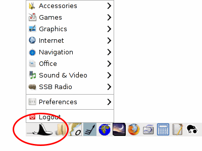
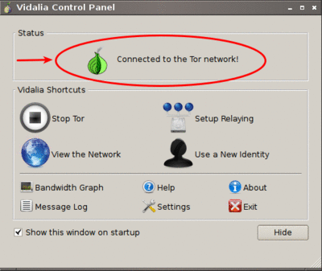
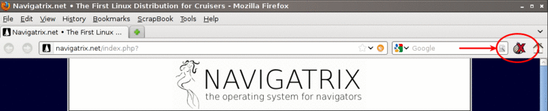
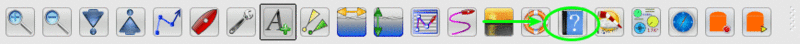
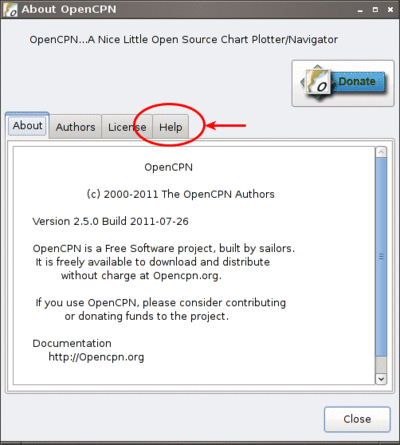

The Applications
================

Navigatrix comes pre-configured with a comprehensive set of applications
for almost anything one could want to do on a boat with a computer:
navigation, communication, word processing and spread-sheeting, photos
and graphics, sound and video, ... - you name it. This section provides
an overview of the applications that can be found under the “Manta Menu”
in the bottom left of the Navigatrix desktop.

 |Manta Menu|

Where available, the text below will provide a link to the applications
online documentation and/or project website for further information.

Accessories
-----------

-  **Archiver**: Compress and decompress data with Xarchiver. Offline help
   under /usr/share/doc/xarchiver/html/index.html (will be opened in
   Firefox when selecting “Contents” from the help menu.) URL:
   `xarchiver.sourceforge.net <http://xarchiver.sourceforge.net/>`__

-  **CD/DVD Burner**: Burn CDs and DVDs with Xfburn. URL:
   `goodies.xfce.org/projects/applications/xfburn <http://goodies.xfce.org/projects/applications/xfburn>`__

-  **Disk Encrypter**: Disk Encryption with TrueCrypt. An excellent
   cross-platform utility to store encrypted files on a physical or
   virtual disk. Good PDF user guide available locally by selecting
   “User's Guide” from the Help menu. The Help menu also contains
   web-links to a beginner's tutorial, FAQs and online documentation.
   There is a `thread on the Navigatrix Support Discussion
   Board <http://navigatrix.net/viewtopic.php?f=10&t=216>`__ on how to
   create a fully encrypted bootable USB stick with Navigatrix. URL:
   `www.truecrypt.org <http://www.truecrypt.org/>`__

-  **File Copier**: Manage files with two panels side by side using Double
   Commander. Handy utility for copying and moving files around the file
   system. Also good for renaming multiple files in one go without
   command line acrobatics, comparing the contents of directories and
   many other basic tasks. URL:
   `doublecmd.sourceforge.net <http://doublecmd.sourceforge.net>`__

-  **File Manager**: Browse the file system and manage the files with
   PCManFM. Similar to the Windows file manager. Default configuration
   will delete files permanently after confirming (no trash bin). You
   can change this in the File Manager's menu under Edit -> Preferences
   by checking “Move deleted files to trash bin”. To toggle displaying
   hidden files on/off  you can use the keyboard shortcut: [ctrl]+[H].
   Under Unix, hidden files start with a “.” and are primarily used for
   configuration files and internal housekeeping. Usually you don’t want
   to see them to avoid clutter but sometimes you’ll need to get to one.
   URL: `pcmanfm.sourceforge.net <http://pcmanfm.sourceforge.net/>`__

-  **Password Storage**: Store your password safely with KeePassX. This is
   the Unix version of the KeePass password manager that is available
   for Windows. The Unix version supports automated login into
   applications and websites. See the “User Guide” available offline
   under the application's help menu. URL:
   `www.keepassx.org <http://www.keepassx.org/>`__

-  **PGP Encryption Keys**: Manage your PGP encryption keys with Seahorse.
   URL:
   `www.gnome.org/projects/seahorse <http://www.gnome.org/projects/seahorse>`__

-  **System Profiler and Benchmark**: Only developer documentation available
   online. Application should be self-explanatory though. URL:
   `wiki.hardinfo.org/Documentation <http://wiki.hardinfo.org/Documentation>`__

-  **Terminal Emulator**: Use the command line with LXTerminal. Can also be
   invoked anytime by pressing [ctrl]+[alt]+[T] key simultaneously. From
   the File Manager's Tool menu you can also open a terminal window in
   the File Manager's current directory (in File Manager: Tools -> Open
   current folder in terminal - pressing [F4] in File Manager does the
   same). URL: `lxde.org <http://lxde.org>`__

-  **Virtual Keyboard**: Use your mouse as a keyboard with onboard.

-  **World Clock**: See the time in other timezones with gworldclock.

Games
-----

-  **Go**: Play the oldest board game of the world with qGo. Extensive
   offline documentation for this game can be accessed `locally on your
   computer <file:///usr/share/doc/gnugo/html/index.html>`__.
-  **Mahjongg**: Disassemble a pile of tiles by removing matching pairs.
-  **Sudoku**: Test your logic skills in this number grid puzzle.

Graphics
--------

-  **Chart Converter**: Convert images to kap charts and calibrate them. The
   menu entry invokes the shell script makekap under /usr/local/bin.
   This script first asks for an image file to be calibrated, converts
   it to “chart.png” under /home/<user>/Desktop and then launches the
   Windows program SeaClear for the user to perform the geo-referencing.
   The user then saves the calibration (as
   /home/<user>/Desktop/CHARTCAL.DIR). Upon the user exiting SeaClear
   the script calls the tif2bsb utility to create a \*.kap chart file
   from the original image plus the calibration data. The chart can be
   loaded into OpenCPN. Sounds complicated but it is in fact pretty
   straight forward and the makekap script displays messages and
   instructions along the way. There is also a `helpful
   entry <http://navigatrix.net/viewtopic.php?f=4&t=325>`__ on the
   Navigatrix Support Discussion Board.
-  **Image Manipulator**: Create images and edit photographs with Gimp.
   Powerful open source image editing at the same level as PhotoShop.
   Extensive offline documentation available under the application’s
   Help-menu. URL: `www.gimp.org <http://www.gimp.org/>`__
-  **Painting Program**: Create pixel art and manipulate digital photos with
   mtPaint. URL:
   `mtpaint.sourceforge.net <http://mtpaint.sourceforge.net/>`__
-  **Photo Manager**: Organize your photos with Shotwell. This is a photo
   library similar to Picasa with some basic image touch-up functions as
   well. URL:
   `www.yorba.org/shotwell <http://www.yorba.org/shotwell/index.html>`__

Internet
--------

-  **EMail Client**: EMail client Sylpheed. Fast and light-weight email
   client. Documentation is available offline under the Help-menu.
   Helpful posts on the Navigatrix Support Discussion Board
   (browser-email integration):
   (`1 <http://navigatrix.net/viewtopic.php?f=10&t=331>`__) and
   (`2 <http://navigatrix.net/viewtopic.php?f=10&t=333>`__) URL:
   `sylpheed.sraoss.jp/en/ <http://sylpheed.sraoss.jp/en/>`__
-  **File Transfer**: Download and upload files via FTP using FileZilla.
   URL: `filezilla-project.org <http://filezilla-project.org>`__
-  **Messenger**: Chat over IM. Supports AIM, Google Talk, Jabber/XMPP, MSN,
   Yahoo and more with Pidgin. URL: `pidgin.im <http://pidgin.im/>`__
-  **Planet Viewer**: Explore, search and discover the planet with Google
   Earth. URL: `earth.google.com <http://earth.google.com/>`__
-  **Relay Chat**: Chat with other people using Internet Relay Chat and
   XChat.
-  **Remote Access**: Share your desktop using a VNC server. You could for
   example run OpenCPN below decks and repeat the desktop image to
   another display/tablet on deck via a wifi link.
-  **Remote Access Viewer**: Connect to a remote desktop using a VNC Viewer.
   The client side counter part to the “Remote Access” VNC server above.
-  **Satellite Connection**: Connect to the Internet using a satellite
   phone. This menu item invokes the shell script
   ``/usr/local/bin/satphone`` which calls another script (``comports`` in same
   directory) to link usb2serial ports and then calls the wvdial PPP
   dialer utility.
-  **Skype**: Internet Telephony with Skype.
-  **Tor Proxy**: Browse Anonymously over the Tor Network with Vidalia. This
   is a tool to bypass restrictions on wifi (or cable) networks that
   block critical information and block downloads based on filename
   extensions. You start Vidalia (*Manta Menu -> Internet -> Tor Proxy*)
   and wait until the window that pops up shows that you are connected
   to the Tor network.

    |Vidalia Control Panel|

   Then, in the Firefox web browser, click on the little onion with the
   red “X” in the upper right (next to the search box) and select
   “Toggle Tor Status” which should make the little onion turn green.

    |Tor Onion in Firefox|

   Just remember with great power comes great responsibility... URL:
   `www.torproject.org/vidalia <https://www.torproject.org/vidalia/>`__

-  **Torrent Client**: Download and share files over BitTorrent with
   Transmission. URL:
   `www.transmissionbt.com <http://www.transmissionbt.com/>`__

-  **Web Browser**: Browse the World Wide Web with Firefox. Navigatrix has
   Firefox pre-configured with some useful add-ons (in addition to the Tor
   “anonymous browsing” utility mentioned above). One is ScrapBook, a utility
   that lets you download webpages, and store and organize them in a library for
   later offline reading. Scrapbook also allows to make annotations to
   downloaded pages. It can be accessed under the ScrapBook menu in Firefox. You
   can display a list of your downloaded pages by pressing ``[alt]+[K]`` in Firefox.
   The other helpful add-on is “DownThemAll!”, a download manager that - amongst
   other things - allows you to download multiple links from a webpage.
   DownThemAll! is available in the context menu in Firefox whenever you
   right-click on a link. It can be configured under *Tools -> DownThemAll! Tools*
   in Firefox.

-  **XGate**: A high-performance e-mail satellite program for satellite phones.
   Requires an account with Global Marine Networks which can be set up through
   the application. There is a free 3 day demo trial available.

   To configure XGate to work with the Sylpheed email client that is
   part of Navigatrix follow these steps:

   #. Start *Manta->Internet->XGate* and setup for your Satellite Phone.
   #. Goto *XGate->Options->Settings->EMail Settings* and choose the Option
      ``Selected mail application within Preferred Mail Client``.
   #. Enter Appcation Path ``/usr/bin/sylpheed`` and click *Ok*.
   #. Start *Manta->Internet->EMail Client* and click on
      *Configuration->Create new account*.
   #. Select ``POP3`` and enter your name and email address (e.g.
      name@ocens.net), click *Forward*.
   #. Enter your Ocens "User ID". Afterwards set POP3 Server to ``127.0.0.1`` and
      SMTP Server ``127.0.0.1``. Leave all check boxes unmarked. Click
      *Forward* and then *Close*.
   #. Now go to *Configuration->Edit accounts*; choose your newly created
      account and click *Edit*.
   #. In tab "Basic" enter the password for your Ocens account into the
      "Password" field.
   #. In tab "Advanced" mark ``Specify SMTP port`` and enter ``2500``. Also
      mark ``Specify POP3 port`` and enter ``1100``.
   #. Thats it! All done and ready to go. When you compose an new email
      make sure you select your Ocens email in the "From" Field. After
      sending the email within Sylpheed you have to click on "Start" within
      XGate. And of course...XGate has to be running when you send an email
      through Ocens within Sylpheed.

Navigation
----------

-  **CelNav**:Celestial Navigation for cruisers; electronic almanac and sight
   reduction. See application's Help menu for details. Addtional info
   available in the
   `Quorum <http://navigatrix.net/viewforum.php?f=21>`__ section of the
   Navigatrix discussion board.

-  **GPS Converter**: A graphical front end to GPS Babel, a pretty universal
   converter between GPS data files in different formats (e.g. OpenCPN's GPX
   format to/from native GPS formats such as various Garmin flavors). The GUI
   should be self-explanatory; detailed help on the underlying GPS Babel program
   is available locally under ``/usr/share/doc/gpsbabel/htmldoc/index.html``.

-  **GPS Panel**: Large GPS Instruments Panel using Matrix Mariner GPS.

-  **GPS Satellites**: Monitor your GPS with XGPS. This is a graphical
   interface to the gpsd daemon described in :doc:`gps`.

-  **Grib Files**: View and Download Grib Files with zyGrib. URL:
   `www.zygrib.org <http://www.zygrib.org/>`__

-  **Grid Calculator**: Distance and bearing calculation with QGrid.

-  **Instrument Panel**: Instrument Panel PolarCOM.

-  **Navigation Console**: Comprehensive collection of navigation tools
   including planetarium, star finder, lunar distance clearing, sight
   reduction, nautical almanac pages, real time almanac and tides. More
   info at `The Navigation Desktop
   Project <http://code.google.com/p/navigation-desktop/>`__ and `the
   developer's website <http://lediouris.net>`__.

-  **Nautical Alamanac:** Nautical alamanc data and sight reduction with
   Nautic.

-  **OpenCPN**: Navigate with OpenCPN. There is extensive offline
   documentation available by clicking on the “?” symbol in the OpenCPN
   toolbar and then on the *Help* tab in the *About OpenCPN* Window.

    |OpenCPN Toolbar|

    |About OpenCPN|

   This will open the local file
   ``/usr/local/share/opencpn/doc/help\_en\_US.html`` in Firefox (it may
   take a while for Firefox to display the page). URL:
   `Opencpn.org <http://Opencpn.org/>`__

-  **Planetarium**: Watch the stars with Stellarium. Excellent star and
   panet finder. Will use your latest GPS position as the point from
   which you view the virtual sky (see :doc:`gps` and :ref:`confignx-app-wrapper-scripts`). URL: `www.stellarium.org
   <http://fwww.stellarium.org/>`__

-  **Polar Smoother**: View, edit and smooth polar data for your boat. Comes
   with a selection of sample polar data files for different boats which
   you can use as a starting point/approximation if you don't have polar
   data for your boat. Look under
   ``/opt/WeatherWizard/all-scripts/polars/polars``.

.. _apps-navigation-qtvlm:

-  **Sailboat Router**: Routing software for virtual and real sailboats.
   This is the qtVlm application that was originally developed as the
   user front end for the “Virtual Loup de Mer” on-line sailing race.
   Feed it with a GRIB wind forecast and polar data for your boat speed
   at varying wind speeds and angles, and it will calculate the
   (theoretically) optimal (fastest) routing to your sailing
   destination. Set up your own boat in the application under Boat ->
   Account Management by adding a new boat and setting the type of boat
   to “Real Boat” rather than “VLM Boat”. Define the polar data for your
   boat under *Boat -> Boat's settings*. You can tweak one of the
   availabel polar data files to fit your boat (these are simple csv
   files - look in ``/opt/qtVlm/polar``). There is extensive help and
   documentation available at the `Virtual Loup de Mer
   website <http://wiki.virtual-loup-de-mer.org>`__, including `specific
   info about the
   application <http://wiki.virtual-loup-de-mer.org/index.php/QtVlm#L.27interface_de_qtVlm>`__.

-  **Tidal Calculator**: Calculate worldwide tides with JTides. URL: 
   `www.arachnoid.com/JTides <http://www.arachnoid.com/JTides/>`__

-  **Tidal Calculator** (legacy): Calculate worldwide tides with WXTide. A
   Windows program which Navigatrix runs under Wine. Has been superseded
   by the “Tidal Calculator” above in the latest version of Navigatrix
   but is still available as “legacy”. URL: 
   `wxtide32.com <http://wxtide32.com/>`__

-  **Tidal Calculator** (USA): View USA tidal and current predictions with
   XTide.

-  **Weather Wizzard**: Superimpose weather fax and GRIB data to check for
   tropical phenomenae. Documentation and examples available at `The
   Weather Wizzard Project <http://weather.lediouris.net/>`__.

Office
------

-  **Calculator**: Perform simple and scientific calculations. Can even be
   switched to RPN mode under *Calculator -> Notation Modes*.

-  **Electronic Library**: E-book library management: Convert, view, share,
   catalogue all your e-books with Calibre. URL:
   `manual.calibre-ebook.com <http://manual.calibre-ebook.com/>`__

-  **Mind Mapper**: Create mind maps with VYM. URL:
   `www.InSilmaril.de/vym <http://www.InSilmaril.de/vym>`__

-  **Personal Organizer**: Personal Organizer Osmo. URL:
   `clayo.org/osmo <http://clayo.org/osmo>`__

-  **Scan Documents**: Scan Documents with Simple Scan. URL:
   `https://launchpad.net/simple-scan <https://launchpad.net/simple-scan>`__

-  **Spreadsheet**: Calculation, Analysis, and Visualization of Information
   with Gnumeric. Gnumeric can read and save MS Excel and Open Office
   formats. While it’s not as feature-rich as Excel, its data analysis
   capabilities are on par and it is very nimble and fast. URL:
   `www.gnumeric.org <http://www.gnumeric.org/>`__

-  **Sticky Notes**: Jot down notes for later on post-it type pads that you
   can put on your desktop.

-  **Text Editor**: Edit text files with medit. This is the more powerful
   one of the two text editors available in Naviagtrix. medit knows
   different high-lighting modes (for various programming and mark-up
   languages, e.g. XML and HTML), can do spell checking, and can be
   extended via external tools. The full manual for medit is available
   under the application's Help menu. The other editor that comes with
   Navigatrix is Leafpad - no frills but lightning quick. Leafpad is not
   accessible through the Manta Menu but by default a double-click on a
   text document in the File Manager will open it in Leafpad. URL:
   `mooedit.sourceforge.net <http://mooedit.sourceforge.net/>`__

.. _apps-office-kiwix:

-  **Wikipedia**: Read wikipedia offline with Kiwix. A great tool if you’re
   in places where the internet is not as ubiquitous. Kiwix is the
   reader application. To get wikipedia content you’ll have download one
   of the data files (“ZIM files”) available at `the Kiwix
   website <http://www.kiwix.org/index.php/Template%3aZIMdumps>`__.
   These files contain compressed wikipedia content and are available in
   several languages. An English version with a selection of 45,000
   articles (pulled from wikipedia in December 2010) is about 3.7 GB to
   download. An English version with all wikipedia articles as of
   January 2012 (but without pictures) is 10 GB to download. Keep in
   mind though, that USB sticks and SD cards typically don't allow
   individual files to exceed 4GB. Hence the 10 GB version will only
   work from a harddisk. URL: `www.kiwix.org <http://www.kiwix.org/>`__

-  **Word Processor**: Compose, edit, and view documents with AbiWord.
   AbiWord can read and save MS Word and Open Document formats (and many
   more). URL: `www.abisource.com <http://www.abisource.com/>`__

Sound and Video
---------------

-  **Music Player**: Listen to music with Audacious.

-  **Video Player**: Play your Videos with MPlayer.

-  **Webcam Application**: Use your webcam with wxCam.

SSB Radio
---------

-  **Airmail**: Check you SSB eMails with Airmail. This is the Windows
   application running under Wine (see :ref:`confignx-installsw-windows`).
   You configure and use the program in the same way as you do under Windows.
   Navigatrix also keeps your position data in Airmail updated with your GPS
   position (see :doc:`gps`). If you use Airmail with a Pactor modem via USB or
   Bluetooth Navigatrix will automatically configure the required com ports.
   For this to work you need to power on your modem *while* it is connected to
   your computer but *before* you start Airmail. If you’re new to Airmail:
   There is a good introduction and “how-to” guide available from the Sailmail
   website at `http://www.sailmail.com/smprimer.htm
   <http://www.sailmail.com/smprimer.htm>`__.

   *Note: Some early versions of Navigatrix version 0.5 had a small
   error in the script that handled the automatic com port set-up. If
   you experience trouble with the automatic com port configuration in Airmail
   please check* `this post
   <http://navigatrix.net/viewtopic.php?p=2533#p2533>`__ *in the Navigatrix
   Support Discussion Base.*

-  **Data Transfer**: Amateur Radio Data Transfer with ARQ and flARQ.

-  **Digital Modem** (fldigi): Amateur Radio Sound Card Communications
   flDigi.

-  **Fax Reciever**: Recieve radio facsimiles with JWX.

-  **Fax Reciever/Sender**: Transmit and recieve radio facsimiles with
   HamFax.

-  **Morse Decoder**: Decode Morse Code with xdemorse.

-  **Navtex Reciever**: Recieve Navtex Weather Data with JNX.

-  **PSKMail**: Transmit and recieve eMail over SSB with jPSKMail.

-  **Radio Terminal**: Use MFSK, RTTY, THROB, PSK31, MT63 and Hellschreiber
   modulations with gmfsk.

-  **Slow TV/FAX**: Transmit and receive slow-scan tv and radio facsimiles
   with QSSTV.

Preferences
-----------

Think "Windows Control Panel". These little utilities should be largely
self explanatory.

-  **Advertising Blocker**: Blocks advertisings on websites.

-  **Appearance Settings**: Customize the look of the desktop.

-  **Bluetooth Manager**: Blueman Bluetooth Manager.

-  **Calibrate Touchscreen**: Run the calibration tool for touchscreens.

-  **Configuration Manager**: Configure and personalize the Openbox window
   manager.

-  **Disk Utility**: Manage Drives and Media.

-  **Firewall Configuration**: Allows you to configure ufw firewall.

-  **Keyboard and Mouse**: Configure keyboard, mouse and other input
   devices.

-  **Keyboard Layout**: Select your keyboard layout.

-  **Language Support**: Configure multiple and native language support on
   your system. See `this
   post <http://navigatrix.net/viewtopic.php?p=1835#p1835>`__ on the
   Navigatrix Support Discussion Board for help on how to change the
   default language setting for the system.

-  **Monitor Settings**: Change screen resolution and configure external
   monitors.

-  **Network Connections**: Manage and change network connection settings.

-  **Online Accounts**: Online account credentials and settings.

-  **Package Manager**: Install, remove and upgrade software packages with
   Synaptic. See the section about :ref:`installsw-from-linux-repo`
   for more information and an example of installing an application with the
   Synaptic Package Manager. In addition, offline documentation can be accessed
   ``/usr/share/synaptic/html/index.html``.

-  **Partition Editor**: Create, reorganize, and delete partitions with
   GParted.

-  **Power Manager Settings**: Settings for the Power Manager.

-  **Printer Configuration**: Configure printers.

-  **Software Center**: Catalogue of publicly available software for your
   system.

-  **Screensaver Properties**: Change screensaver properties.

-  **Sound Mixer**: ALSA Sound Mixer.

-  **Startup Disk Creator**: Create a startup disk using a CD or disc image.

-  **Time and Date**: Change system time, date, and timezone.

-  **Users and Groups**: Add or remove users and groups.

