`Navigatrix Hilfe (in Englisch) <index.html>`__

`Navigatrix home <http://navigatrix.net>`__

Navigatrix auf Deutsch Installieren und Einrichten
==================================================

Dieses Dokument beschreibt die Installation von Navigatrix 0.5 auf der
Festplatte eines Rechners. Zusätzlich werden die Schritte erläutert, die
im Anschluss an die Installation erforderlich sind, um Navigatrix in
deutscher Sprache zu konfigurieren. Navigatrix lässt sich auch
vollständig von einem USB-Stick oder einer SD-Karte starten und
benutzen. In diesem Fall wird die Festplatte geparkt. Dies kann
insbesondere auf See sinnvoll sein, um Beschädigungen an der Festplatte
zu vermeiden oder als Backup-System im Falle eines Festplattenfehlers.
Eine Installation auf Festplatte ist für den täglichen Gebrauch dennoch
zu empfehlen, da das System von einer Festplatte im Vergleich zu einem
USB-Laufwerk deutlich schneller startet und läuft.

Wer das englischsprachige Navigatrix 0.5 bereits auf der Festplatte
installiert hat, kann direkt zu `Navigatrix auf Deutsch
Einrichten <DE_installing_nx.html#sec_anpassen_nx_de>`__ gehen.

Navigatrix auf Festplatte Installieren
--------------------------------------

Mit einem boot-fähigen Navigatrix USB-Stick/SD Karte oder DVD ist die
Installation auf der Festplatte in den allermeisten Fällen
unkompliziert. Navigatrix lässt sich neben einem bestehenden
Betriebssystem installieren (in vielen Fällen Windows als das System,
mit dem der Rechner ausgeliefert wurde), so dass man anschliessend zu
Beginn des Bootprozesses jeweils auswählen kann, unter welchem System
man den Rechner starten möchte.

Für die Installation muss der Rechner zunächst vom Navigatrix
USB-Stick/SD Karte gestartet werden. Um den Rechner von einem
USB-Laufwerk statt von Festplatte zu starten, muss man ggf. unmittelbar
nach Einschalten des Rechners eine Funktionstaste drücken, um die
Bootreihenfolge zu ändern (USB-Laufwerk vor Festplatte). Bei den meisten
Rechnern wird hierzu zu Beginn des Bootvorgangs für einige Sekunden
“Press <F2> to enter setup” oder ähnlich in der Statusleiste am unteren
Rand des Bildschirms angezeigt, bevor das Betriebssytem hochfährt.

Sobald Navigatrix hochgefahren ist, sollte oben links auf dem Desktop
ein Anwendungssymbol mit dem Titel “Harddisk install option” zu sehen.
Der Installations vorgang wird durch Doppelklick auf dieses Symbol
gestartet.

|Harddisk install option on desktop|

Das Installationsprogramm führt dann durch die Schritte der
Festplatteninstallation.

#. Zunächst lässt sich die Sprache auswählen, die für den
   Installationsvorgang verwendet wird (Anmerkung: dies ist nicht die
   Sprache, in der das System nach abgeschlossener Installation läuft,
   sondern lediglich die Sprache, die für die Installationsdialoge
   verwendet wird)

-  |Sprache für Installation einstellen|

2. Als nächstes erscheint ein Formular, das prüft, ob die
   Voraussetzungen für die Installation erfüllt sind.

-  |Installationsvoraussetzungen|

-  Wichtig: Entgegen der Empfehlung auf dem Formular sollte der Rechner
   während der Installation *nicht* mit dem Internet verbunden sein.
   Zusätzlich sollten die Optionen zum Herunterladen von
   Aktualisierungen und Software von Drittanbietern *nicht* ausgewählt
   werden. Diese Aktualisierungen sind für den Betrieb von Navighatrix
   nicht erforderlich. Nebem dem unnötigen Verbrauch von ggf. knapper
   Netzwerkbandbreite können unkontrollierte Aktualisierungen im
   ungünstigsten Fall dazu führen, das Komponenten des Systems nicht
   mehr reibungslos miteinander funktionieren. Die in Navigatrix
   enthaltenen Softwarekomponenten und deren Versionsstände sind
   sorgfältig aufeinander abgestimmt, um einen stabilen Betrieb
   untereinanden und mit externen Komponenten wie GPS, AIS, Pactor usw.
   zu gewährleisten. Bei Softwareversionen bedeutet “neuer” häufig nicht
   “besser”, was Fehleranfälligkeit und Stabilität angeht. Falls
   erforderlich oder gewünscht, können einzelne Komponenten *nach*
   abgeschlossener Installation gezielt und kontrolliert aktualisert
   werden.
-  Falls sich ein Wireless Netzwerk in der Nähe befindet, wird als
   nächstes gefragt, ob der Rechner sich für die Installation mit diesem
   verbinden soll. Auch hier gilt wieder: Keine Verbindung während der
   Installation aus den oben genannten Gründen.
-  |Funknetzwerk|

3. Jetzt geht's ans Eingemachte und es wird festgelegt, wie Navigatrix
   installiert werden soll.

|Installationsart|

Im einfachsten Fall wird die gesamte Festplatte gelöscht und Navigatrix
wird als einziges Betriebssystem auf dem Rechner installiert (Option 2).
In den meisten Fällen wird jedoch gewünscht, Navigatrix *neben* einem
bestehenden Betriebssytem (z.B. Windows, oder einer andere
Linux-Version) zu installieren, so dass man anschliessend jeweils beim
Start des Rechners auswählen kann, unter welchem Betriebssystem der
Rechner hochfahren soll. Dies ist unter den Optionen (1) und (3)
möglich. Unter Option (1) wird automatisch eine neue Partition auf der
Festplatte für Navigatrix angelegt, während man unter Option (3)
auswählen kann, in welche bereits bestehende Partition Navigatrix
installiert werden soll. Zusätzlich lassen sich unter Option (3)
einzelne Zweige des Dateisystems in unerschiedlichen
Festplattenpartitionen installieren. Dies kann sinnvoll sein, um z.B.
den home Verzeichnisbaum getrennt vom eigentlichen Betriebssytem
abzulegen, so dass beim Wechsel auf ein neueres Navigatrix Release in
der Zukunft die Dateien des Anwenders erhalten bleiben.

Im Folgenden wird zunächst die einfachere Option (1) beschrieben. Diese
ist ausreichend, wenn auf dem Rechner bisher lediglich *ein* anderes
Betriebssystem vorhanden ist. Anwender, die bereits mehrere
Betriebssysteme auf ihrem Rechner haben und/oder mit der Einrichtung und
Verwaltung von Festplattenpartitionen vertraut sind, sollten Option (3)
auswählen, die weiter unten beschrieben wird.

Zunächst also das weitere Vorgehen für Option (1), “Navigatrix daneben
installieren”. Hier muss im nächsten Formular lediglich ausgewählt
werden, wieviel Platz auf der Festplatte für Navigatrix reserviert
werden soll:

|Navigatrix neben einem bestehenden OS isntallieren|

Wie in der Abbildung gezeigt, kann in diesem Formular der Balken, der
die bestehende Partition von der für Navigatrix neu einzurichtenden
Partition trennt, mit der Maus verschoben werden, um das
Größenverhältnis der beiden Partitionen anzupassen. Sofern Musik-, Bild-
und Videodateien auf der bereits bestehenden Partition verbleiben
sollen, dürften 40-50GB für Navigatrix großzügig genug angelegt sein, um
Seekarten, Email, elektronische Bibliothek, eine komprimierte
Offline-Version von Wikipedia und andere Anwenderdateien zu speichern.
Im Zweifelsfall sollte man dies noch mal überschlagsmäßig unter Kenntnis
des eigenen Bedarfs abschätzen. Das eigentliche Betriebssystem schlägt
bei Navigatrix mit knapp 6GB zu Buche, so dass der Rest für
Anwenderdateien (inkl. Seekarten, Email usw.) zur Verfügung steht. Auf
Dateien in einer bereits bestehenden Windows Partition kann man von
Navigatrix aus zugreifen. Umgekehrt ist dies allerdings nicht der Fall
(d.h. von Windows aus hat man i.d.R. keinen Zugriff auf Dateien, die in
der Navigatrix Partition abgelegt werden).

Für Option (1), “Navigatrix daneben installieren”, ist dies bereits
alles und es geht weiter unten mit Schritt 4 weiter. Hat man Option (3),
“Etwas anderes”, ausgewählt, sind einige zusätzliche Schritte
erforderlich.

|Navigatrix in einer oder mehreren speziellen Partition(en)
installieren|

Für diese Optione sollte man am besten vor Beginn des
Installationsvorgangs die Festplattenpartitionen so einrichten, wie man
sie für die Installation benötigt. In Navigatrix selbst steht dazu
GParted als Werkzeug zur Verfügung (im Anwendungsmenu am unteren linken
Bildschirmrand unter Preferences -> Partition Editor). Wir gehen hier
davon aus, dass der Anwender, der Option (3), Etwas anderes, auswählt,
mit diesen Werkzeugen vertraut ist und erklären sie daher hier nicht
weiter (die GParted Anwendung enthält außerdem eine ausführliche -
allerdings englischsprachige - Hilfe).

Es lassen sich so z.B. drei Partitionen für die Navigatrix-Installation
anlegen:

#. Eine etwa 10GB große Partition für das eigentliche Betriebssystem
   samt Anwendungen (einschließlich etwas Reserve, falls man z.B. später
   zusätzliche Anwendungen installieren möchte). Als Dateisystem hierfür
   “ext4” auswählen.
#. Eine Swap-Partition zur Auslagerung von Hauptspeicheroperationen,
   falls selbiger ausgeht. Dies ist nur erforderlich, sofern es nicht
   bereits eine bestehende linux-swap Partition auf der Festplatte gibt
   (in GParted als solche erkennbar). 4GB sollten hierfür großzügig
   bemessen sein.
#. Der Rest an verfügbarer Plattenkapazität wird dem Anwender home
   Verzeichnis zugeschlagen und steht für Anwender- und
   Konfigurationsdateien zur Verfügung. Als Dateisystem hierfür
   ebenfalls “ext4” auswählen.

Diese Aufteilung erlaubt, bei einem evtl. späteren Releasewechsel von
Navigatrix lediglich das eigentliche System neu in die oben erstgenannte
Partition zu installieren, dabei aber alle Anwender- und
Konfigurationsdateien unter home beizubehalten.

Hat man die erforderlichen Partitionen eingerichtet und dann im oben
gezeigten Formular
“\ `Installationsart <DE_installing_nx.html#img_installationsart_anderes>`__\ ”
die dritte Option Etwas anderes ausgewählt, gelangt man zu folgendem
Formular:

|Navigatrix in einer oder mehreren speziellen Partition(en)
installieren|

Hier lässt sich nun festlegen, in welche Partitionen die einzelnen
Systembestandteile installiert werden sollen. Dazu unter “Laufwerk”
jeweils die enstprechende Partition auswählen und auf die Schaltfläche
Change klicken. Dies öffnet ein weiteres Dialogfenster, in dem die
Einstellungen für die jeweilige Partition vorgenommen werden können:

|Navigatrix in einer oder mehreren speziellen Partition(en)
installieren|

Sofern die Partionen bereits zuvor mit der richtigen Größe angelegt
wurden, kann die hier in MB angezeigte Größe unverändert bleiben. Man
braucht also lediglich Unter Benutzen als: die Liste aufklicken und in
der sich öffnenden Auswahl das richtige Dateisystem markieren.

|Navigatrix in einer oder mehreren speziellen Partition(en)
installieren|

Zusätzlich muss in dem sich neu öffnenden Feld Mount point festgelegt
werden, was in dieser Partition installiert werden soll. Für das
eigentliche Betriebssystem samt Anwendungen ist das Root-Verzeichnis
(“/”) auszuwählen, für das home Verzeichnis “/home”. Bei Bedarf kann man
die Partition zusätzlich neu formatieren lassen.

Nachdem man diese Einstellungen vorgenommen hat, erscheint eine Warnung,
dass diese Änderungen zunächst zur Festplatte zurückgeschrieben werden
müssen.

|Navigatrix in einer oder mehreren speziellen Partition(en)
installieren|

Klickt man auf Weiter erscheint nochmals die Partitionsübersicht, auf
der man jetzt Jetzt installieren anklicken kann.

|Navigatrix in einer oder mehreren speziellen Partition(en)
installieren|

4. Als nächstes wählt man seinen Standort aus, der für regionale
   Einstellungen wie Datum, Uhrzeit, Zahlen- und Währungsformate benutzt
   wird.

-  |Standortauswhl|

5. Weiter geht's mit der Auswahl der Tastaturbelegung.

-  |Tastaturbelegung|
-  Wichtig: Bei diesem Schritt aufpassen und am besten die ausgewählte
   Belegung in dem entsprechenden Eingabefeld durch die Eingabe einiger
   Sonderzeichen überprüfen. Im nächsten Schritt wird nämlich ein
   maskiertes Passwort eigegeben. Wenn dieses Sonderzeichen enthält und
   diese mit falscher Tastaturbelegung eingegeben werden, hat man i.d.R.
   kaum eine Chance, dieses Passwort später zu rekonstruieren.

6. Schliesslich sind noch einige Angaben zu Benutzername und Passwort
   erforderlich.

-  |Wer bist du denn?|
-  Auch, wenn man hier “Automatische Anmeldung” auswählt, sollte man
   sich das gewählte Passwort unbedingt merken, da sich später im System
   administrative Funktionen nur mit diesem Passwort ausführen lassen.

#. Das war's! Nachdem man im letzten Formular auf Weiter gekilckt hat,
   läuft die Installationsmaschinerie an und kleine Dialogfenster
   informieren über den Fortgang.

-  |Dateien kopieren|
-  Nachdem dies alles seinen geordneten Gang genommen hat, erscheint ein
   Dialogfenster, dass "Ich habe fertig!" verkündet
-  |Ich habe fertig|
-  Hier empfiehlt es sich Ausprobieren fortsetzen" auszuwählen, da es
   sonst bei einem unmittelbaren Neustart unter Umständen schwierig ist,
   den USB-Stick oder die SD-Karte genau im richtigen Moment zu
   entfernen, bevor der Rechner erneut von dieser statt von der
   Festplate startet.

Navigatrix auf Deutsch Einrichten
---------------------------------

*\*\*\* Note: Ab Navigatrix Version 0.5 vom September 2013 ist das
deutsche Sprachpaket bereits in der Installation enthalten. Ab dieser
Version muss ggf. lediglich die `Spracheinstellung geändert
werden <DE_installing_nx.html#deutsch_nach_oben>`__, es müssen aber
keine zusätzlichen Pakete heruntergeladen und installiert werden. Die
nachfolgende Anleitung gilt also für Navigatrix 0.4 sowie die 0.5
Versionen vom Juli und August 2013.*

Um mit Navigatrix weitestgehend in Deutsch zu arbeiten, muss nach
erfolgter Festplatteninstallation die deutsche Sprachunterstützung
installiert und aktiviert werden (Wörterbuch, Thesaurus, Hilfedateien,
Anpassung von Datums-, Zahlen- und Währungsformaten). Damit wird die
eigentliche Arbeitsumgebung auf Deutsch umgestellt. Es hängt dann
jeweils noch von der einzelnen jeweils benutzten Anwendung ab, ob diese
ebenfalls Deutsch unterstützt und die Anwendungsmenüs, -hilfe usw. in
Deutsch erscheinen. Dies ist z.B. für die Gnumeric Tabellenkalkulation,
den Firefox Web-Browser und das Sylpheed Email-Programm der Fall. Die
Airmail-Anwendung ist jedoch z.B. - wie auch unter Windows - weiterhin
nur in Englisch verfügbar, ebenso wie einige kleinere Anwendungen zur
Unterstützung von Navigation und Kommunikation.

Wer häufig auf Befehlszeilenebene in der Konsole arbeitet und die
deutschen "man pages" des Unix Systems vorzieht, kann diese zusätzlich
zu den beiden oben angeführten Schritten installieren (in dieser
Anleitung nicht weiter erläutert).

Nun aber zu den Details.

Installieren und Aktivieren der deutschen Sprachunterstützung
~~~~~~~~~~~~~~~~~~~~~~~~~~~~~~~~~~~~~~~~~~~~~~~~~~~~~~~~~~~~~

Hierzu ist eine Internetverbindung mit ausreichendem “Durchmesser”
erforderlich, da bei diesem Schritt ca. 75MB zusätzliche Daten
heruntergeladen werden. Die einzelnen Schritte für das Installieren und
Aktivieren der deutschen Sprachunterstützung werden im Folgenden kurz
beschrieben.

#. Im Manta-Menü Preferences -> Language Support auswählen.

-  |Language Support im Manta Menü|

2. Das System prüft dann zunächst, ob für die bereits installierten
   Sprachen (Englisch, Spanisch und Französisch) alle Komponenten
   vorhanden sind.

-  |Checking available language support|
-  Als Ergebnis der Überprüfung wird angezeigt, dass die
   Sprachunterstützung für die bereits installierten Sprachen nicht
   vollständig ist.
-  |Support not complete|
-  Hier kann man getrost “Remind me later"” anklicken, da ansonsten noch
   größere Datenmengen für die bereits installierten Sprachen
   heruntergeladen werden. Insbesondere die umfangreichen Hilfe-Dateien
   für das Bildbearbeitungsprogramm GIMP in Spanisch und Französisch
   sind im Navigatrix Lieferumfang nicht enthalten, und man kann sich
   das Herunterladen dieser Dateien hier sparen.

3. In den dann sichtbaren Formular werden die bereits installierten
   Sprachen angezeigt.

-  |Language Support|
-  Ein Klick auf Install/Remove Languages... bringt eine Auswahlliste
   zur Anzeige, in der man durch Anklicken der Box rechts eine oder
   mehrere neue Sprachen zur Installation makieren kann.
-  |Language Support - Installed Languages|
-  Nachdem man hier Deutsch ausgewählt hat, klickt man Apply Changes,
   woraufhin man zunächst zur Eingabe seines Administrationspassworts
   aufgefordert wird.
-  |Authentication|
-  Hier ist das Passwort einzugeben, das man `bei der Installation
   festgelegt hat <DE_installing_nx.html#enum_item_install_user_info>`__
   (sofern man dieses nicht im Nachhinein geändert hat).
-  Wenn man nach erfolgter Passworteingabe auf die Authenticate
   Schaltfläche klickt, startet das Herunterladen der deutschen
   Sprachpakete und deren anschliessende Installation. Ein Formular
   informiert über den Fortschritt des Ganzen.
-  |Applying changes|
-  Sobald die Installation abgeschlossen ist, erscheinen im Formular
   “Language Support” nun auch die Einträge für Deutsch. Damit steht nun
   z.B. die Deutsche Rechtschreibprüfung im Textverarbeitungsprogramm
   zur Verfügung.
-  |Language Support mit Deutsch|

4. Um die Arbeitsoberfläche und Anwendungsmenüs standardmäßig auf
   Deutsch umzustellen, muss der entsprechende "Deutsch" Eintrag in der
   Liste noch mit der Maus an die oberste Stelle, über “Englisch”
   gezogen werden.

-  |Deutsch nach oben verschieben| |Deutsch ganz oben|
-  Anschließend klickt man noch auf die Schaltfläche Apply System-Wide
   (erfordert erneute Passworteingabe).

6. Schließlich muss man sich noch einmal aus- und wieder einloggen,
   damit die vorgenommenen Änderungen wirksam werden (ansonsten ist dies
   beim nächsten Neustart des Rechners der Fall). Bei der Neuanmeldung
   wird man gefragt, ob man die Standardordner in seinem home
   Verzeichnis in die jeweiligen deutschen Bezeichnungen umbenennen
   möchte.

-  |Ordner umbenennen|
-  Wählt man hier Namen aktualisieren aus, muss man berücksichtigen,
   dass die Lesezeichen, die links im Dateimanager angezeigt werden,
   dann auf die alten bzw. nicht mehr existente Ordnernamen verweisen
   und manuell gelöscht und neu angelegt werden müssen. Zusätzlich
   müssen ggf. bestehende Dateien aus den alten in die neuen Ordner
   verschoben werden.
-  |Ordner umbenennen|

Das war's. Im Manta Menü erscheinen nun deutsche Anwendungskategorien.

|Deutsches Manta Menu|

Sofern die jeweiligen Anwendungen dies Unterstützen, erscheinen Menüs
und Benutzerführung innerhalb der Anwendungen ebenfalls in Deutsch, wie
hier am Beispiel der Tabellenkalkulation Gnumeric gezeigt.

|Gnumeric in Deutsch|

|web analytics|

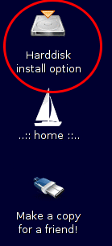
.. |Sprache für Installation einstellen| image:: images/install_01_willkommen.gif
.. |Installationsvoraussetzungen| image:: images/install_02_vorbereitung.gif
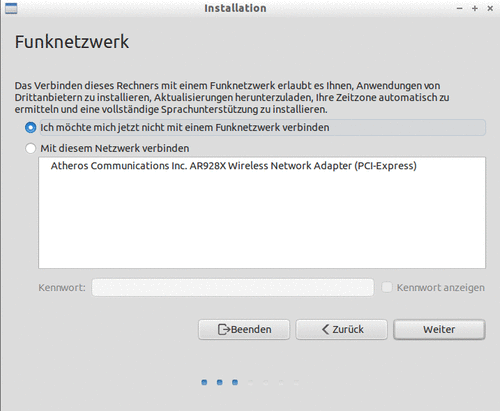
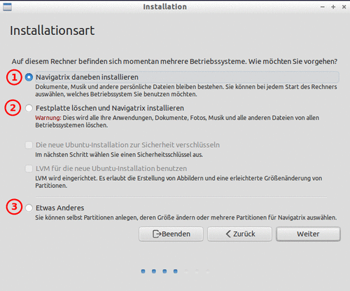
.. |Navigatrix neben einem bestehenden OS isntallieren| image:: images/install_04a1_nx_daneben.gif
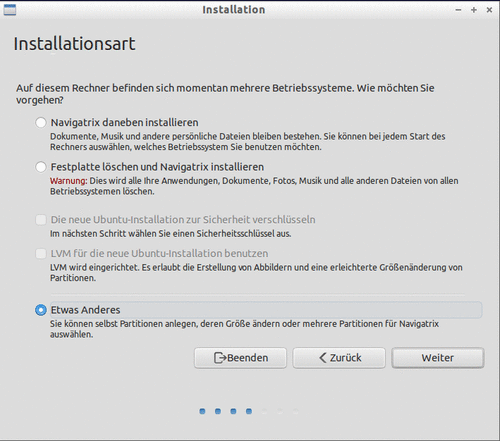
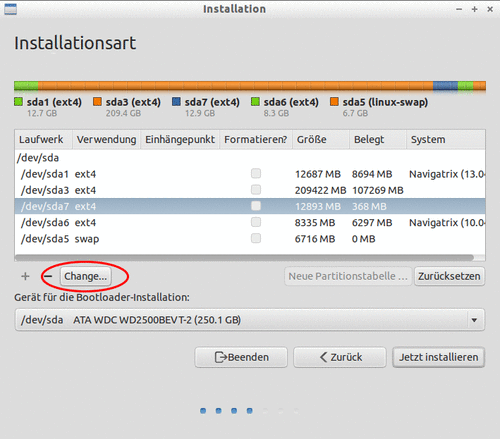
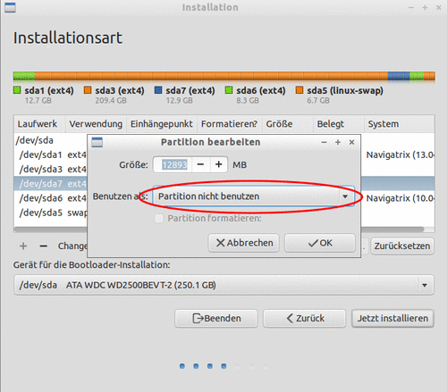
.. |Navigatrix in einer oder mehreren speziellen Partition(en) installieren| image:: images/install_04b3_installationsart.gif
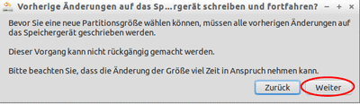
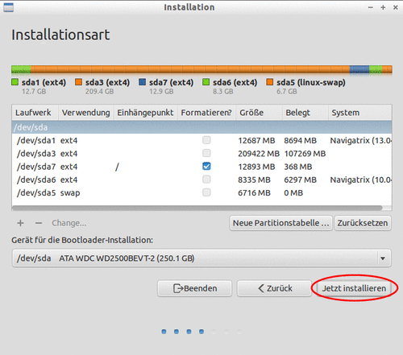
.. |Standortauswhl| image:: images/install_05_wo_befinden.gif
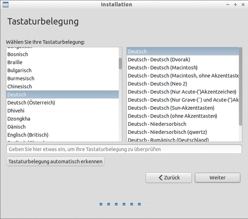
.. |Wer bist du denn?| image:: images/install_07_wer_bist_du_denn.gif
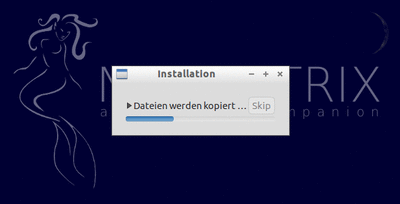
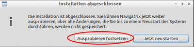
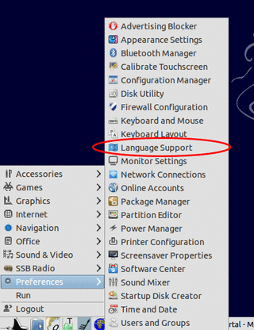
.. |Checking available language support| image:: images/02_checking_available_support.gif
.. |Support not complete| image:: images/03_not_installed_completly.gif
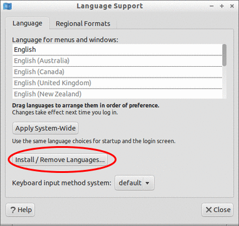
.. |Language Support - Installed Languages| image:: images/06_installed_languages_with_selection.gif
.. |Authentication| image:: images/07_authenticate.gif
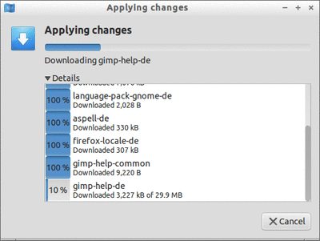
.. |Language Support mit Deutsch| image:: images/09_language_support_with_german.gif
.. |Deutsch nach oben verschieben| image:: images/10_moving_german.gif
.. |Deutsch ganz oben| image:: images/11_german_on_top.gif
.. |Ordner umbenennen| image:: images/12_ordner_automatisch_umbenennen.gif
.. |Ordner umbenennen| image:: images/13_deutsche_ordner.gif
.. |Deutsches Manta Menu| image:: images/14_manta_zubehoer_mixed.gif
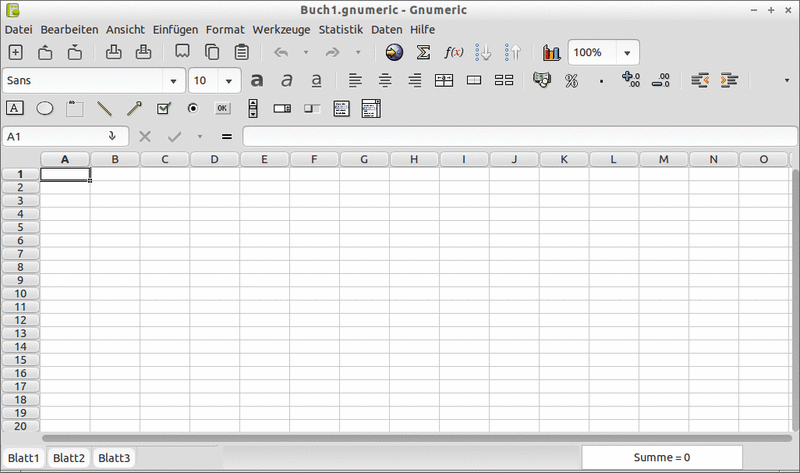
.. |web analytics| image:: http://c.statcounter.com/8655217/0/04865527/1/
   :target: http://statcounter.com/
